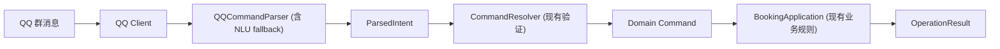

# QQBot NLU 模块设计方案（v1）

> 适用项目：果壳吉协琴房预约 QQ Bot（v3.1.0）  
> 状态：**方案评审中，未开始实现**  
> 配套文档：`QQBot-v3.1.0-DEVELOPER-HANDBOOK.md`（下称「手册」）

---

## 1. 背景与目标

### 1.1 现状

- 现有 `QQCommandParser`（`qqbot/interfaces/qq/parser.py`）用「动作前缀 + 正则」解析输入，输出稳定的 `ParsedIntent(operation, arguments, admin)`。
- 用户必须按模板说话（`预约 303 7-8`、`查询 303 +1`），不匹配就抛 `ParseError` → help 提示。
- 手册 1.2 / 10.1 已明确：`ParsedIntent` 是**未来 NLP Parser 的预留接入点**。

### 1.2 目标

让用户**用更口语化的表达**也能完成全部普通用户端操作：

```
「明天下午帮我看看303有没有空」  → query_free
「帮我把周三晚上约了」            → create_reservation
「今天约过的都有啥」              → query_personal
「取消我明天的预约」              → cancel_reservation
```

### 1.3 非目标（明确不做）

- ❌ 不做端到端 NLU（不训槽位抽取模型，槽位永远走规则）。
- ❌ 不做多轮对话 / 上下文记忆。
- ❌ 不碰管理员通道（`#` 开头）——保持严格正则，安全优先。
- ❌ 不引入 jieba / torch / transformers / 大模型。

### 1.4 资源约束（决定技术选型）

| 指标 | 数值 | 结论 |
| --- | --- | --- |
| CPU | 双核 2.5GHz | 推理微秒~毫秒级，无压力 |
| 内存 | 1.5GB 总量，可用 ~700MB | **增量预算 ≤ 50MB** |
| 模型大小 | — | **≤ 100KB**（sklearn 线性模型） |
| 推理耗时 | — | 加载 <50ms，推理 <1ms |

结论：**传统 ML（sklearn 线性分类器）是唯一现实选择**，且完全够用。

---

## 2. 总体架构：为什么是「一层 fallback」而不是复杂分层

### 2.1 直接回答「分层真的有必要吗」

**没有必要做复杂的多层漏斗。** 最终实现只有一个 fallback 点：

```
parse(raw_text)
 ├─ ① 现有正则逻辑（原封不动）── 成功 → ParsedIntent ✅
 ├─ ② 失败（ParseError）── 尝试 NLU
 │     ├─ NLU 命中且置信度达标 → ParsedIntent ✅
 │     └─ 未命中 / 置信度不足 → 抛回原 ParseError → help（行为与今天完全一致）
```

要点：

1. **现有代码零改动**：正则路径的每一行逻辑、每一个错误消息都不动。NLU 是纯加法。
2. **对外接口不变**：`parse()` 的签名、返回类型、异常类型都不变，Resolver 和上层无感知。
3. **「分层」只是代码组织**：NLU 逻辑放在独立模块 `qqbot/interfaces/qq/nlu.py`，理由是**可单测、可独立关闭、可审查**——不是流程复杂度。
4. **为什么不让 NLU 先跑**：正则命中 = 100% 确定，没必要让概率模型先说话；正则失败 = 用户没按格式说，这才是 NLU 该接的输入。

### 2.2 与手册架构的关系



NLU 只替换 Parser 内部的「文本 → ParsedIntent」环节，**下游每一层都不认识 NLU**。

### 2.3 运行方式（内嵌，不做独立服务）

**结论**：NLU 模块内嵌在 bot 进程内，共享单例，懒加载，复用现有 scheduler。**不引入独立进程/服务**。

| 负载 | 运行方式 | 理由 |
| --- | --- | --- |
| Phase 0 规则引擎 | 内嵌，与 `self.parser` 并列的共享单例（挂在 `PianoBotClient` 上） | 纯函数、零依赖、微秒级，无理由离开进程 |
| Phase 2 ML 分类器 | 内嵌 + **懒加载**（首次命中 NLU 时才加载，或按配置开关） | 模型 ~30-50MB，懒加载平时零开销 |
| 夜间 LLM 批处理 | 复用现有 `AsyncIOScheduler`，04:00 与归档清理并列（`on_ready` 启动、`close` 关闭） | 项目已有该 job，加一个 `nlu` job 即可，生命周期复用 |

**为什么不做独立服务**：

- **资源账算不过**：1.5GB 内存已常驻 3 个 Chromium（手册 25.2），再开进程 = 重新分配内存 + 守护进程 + 崩溃重启逻辑，得不偿失；
- **项目是单体哲学**：架构是单进程 `Client → Parser → Resolver → Application` 一条链，NLU 只是替换 Parser 内部环节，无跨进程理由；
- **IPC 是新的故障源**：HTTP/gRPC 要处理超时/重试/序列化，而 NLU 与 bot 本就共用 `ParsedIntent` 协议，进程内直接调用零开销。

**必需的安全设计——异常隔离**：内嵌最怕「NLU 崩了带崩 bot」。fallback 链外必须包 try/except：

```python
try:
    intent = self._try_regular(raw_text)   # 现有正则
except ParseError:
    intent = self._try_nlu(raw_text)       # NLU，全部异常吞掉
    if intent is None:                     # NLU 失败/异常/低置信
        raise ParseError("help")           # 回到原来的行为
```

NLU 内任何异常（模型损坏、内存不足、规则 bug）都被吞掉并 fallback 到 help——**bot 主链路永远不受影响**。

---

## 3. Phase 0：规则引擎（零训练，立即可用）

### 3.1 组成

| 组件 | 职责 | 幻觉风险 |
| --- | --- | --- |
| 同义词表 | 意图动词归一化 | 低（可审查） |
| 口语化模板 | 常见句式匹配 | 低（可审查） |
| 相似度匹配（可选） | 模板未命中时按字符 n-gram 相似度兜底 | 中（**需阈值，见第 4 节**） |

### 3.2 意图判定策略（产品决策：默认查询）

**核心决策（2026-08-22 主人定）**：查询（`query_schedule`）能返回最多的信息，空闲（`query_free`）和个人（`query_personal`）只是**换一种呈现方式**。因此意图触发必须保守：

- **模糊动作词（看看/看下/查查/查一下/查询）→ 默认 `query_schedule`**，即使只有房间或日期、没有其他关键词；
- **`query_free` 只在明确说了「有空/空闲/空不空/能约吗/空着/有位置」等词时触发**（`有空吗`/`有没有空` 这类疑问形式也视为明确）；
- **`query_personal` 只在明确个人指引时触发**（我的预约/我约的/我订的/查询个人/查一下我的…）；
- 冲突消解：出现「取消/退了」等取消信号时预约意图清零；出现「我的/预约记录」等个人信号时普通查询意图清零（防止「把预约退了」「查询个人」被子串关键词误判）。

同义词表（实现态）：

| 意图 | 触发词 |
| --- | --- |
| `create_reservation` | 预约、约、订、预定、开（一个）、约一下、帮我约 |
| `cancel_reservation` | 取消、退了、不去了、撤销预约 |
| `query_schedule` | 查询、查、看看、看下、看一下、查一下、有没有人 |
| `query_free` | 空闲、有空、有没有空、空不空 |
| `query_personal` | 查询个人、我的预约、我约的、今天约的 |

### 3.3 实体与模板（实现态）

**实体抽取（本地规则，纯词法）**：

| 实体 | 支持 | 备注 |
| --- | --- | --- |
| 时间 | 中文数字（上午八点→08:00）、数字（7-8、7:00-8:30）、起点+时长（下午3点练2h→15:00-17:00）、下午语境推断（「下午约304b 3点到5点」→15:00-17:00） | 半小时网格，`Resolver.parse_time` 兜底验证 |
| 时长 | 2h / 两小时 / 一个半小时 | 起点+时长推导终点；无起点 → fail-closed |
| 日期 | 今天/明天/后天/大后天/今晚/明晚/后N天/N天后（**自然日语义**，见 3.5） | 显式 `+N` 走业务日语义 |
| 房间 | **gazetteer 白名单**（配置 name+aliases，最长匹配+边界）、数字（303/304a）、**语音数字朗读**（三零三 → 提取原文，Resolver 别名归一化）、「琴房/排练室」泛称 → 缺省 | 白名单 = 配置 aliases + `room_whitelist.json` 补充源（见 5.4.2）；归一化永远在 Resolver |
| 称呼词 | 「小泉，」「玉泉路琴房帮我…」→ 解析前剥离（`strip_name_prefix`） | 避免污染意图/房间/他人检测 |

**句式模板（实现态）**：去X练琴、约/订X、X有没有空、哪个房间空、我是/我叫+姓名学号——模板只判意图，房间除「去X练琴」外统一整句提取。

**通道顺序**：句式模板（score 1.0）→ 关键词评分（0.85，含宾语排除）→ ML 分类器（Phase 2，置信度门槛）。

### 3.4 输出与槽位

- NLU 只负责输出 **operation + arguments 里的原始 token**（房间名文字、时间文字、日期提示词）。
- **所有槽位解析（时间→`TimeRange`、日期→`date`、房间→`room_id`）一律交给现有 `CommandResolver`**（`application/resolver.py` 的 `parse_time`/`parse_date`/`room_by_reference`）。
- NLU 抽不出来的槽位就**缺省不填**，由 Resolver 的缺省逻辑或报错兜底（见 4.3）。

### 3.5 自然日语义（产品决策 2026-08-22）

**日期词（今天/明天/后天/今晚/明晚/后N天）一律按自然日理解**，与业务日（手册 6.1，22:00 切换）区分：

- NLU 输出 `natural_date`（自然日偏移：今天=0、明天=1、后天=2…），**不读当前时间**（手册 10.2）；
- `Resolver` 按当前时刻换算业务偏移：`business = natural - (1 if now >= config.business_boundary else 0)`——22:00 后业务日已切到「自然日明天」，所以自然日「明天」= 业务日 `+0`；
- `business < 0`（22:00 后说「今天」）→ `ParseError("natural_past")`，文案提示「今天已过边界」；
- **显式 `+N` 保持业务日语义不变**（用户显式使用系统格式，22:00 后 `+1` = 自然日后天）；
- 边界时间全部来自 `config.business_boundary`（不硬编码 22:00）；
- 多日期查询降级输出 `natural_range`（自然日范围，Resolver 同样换算）。

修复动机：22:00 后用户说「明天」曾被解析成业务日 `+1` = 自然日后天（约错一天）；说「今天」被解析成业务日 `+0` = 自然日明天。

### 3.6 星期表达（周一制，产品决策 2026-08-23）

**「周X/星期X/礼拜X」一律按周一制理解（周一是每周第一天）**，与自然日词同架构——NLU 只提取星期原语，不读当前时间：

- NLU 输出 `weekday`（1-7，周一=1）+ `week_mode`（`next` 无前缀=接下来最近、`this` 本周、`next_week` 下周、`prev_week` 上周）；
- `Resolver` 按当前日期换算绝对日期（`_weekday_target`）：
  - `next`：`today + ((weekday - today_wd) % 7)`——含今天（周日说「周三」→ 下周三）；
  - `next_week`：本周一 + 7 + (weekday-1)——**今天周日说「下周一」= 明天**（明天即下周第一天）；
  - `this`：本周一 + (weekday-1)，已过 → `natural_past` 拒绝；`prev_week`：恒过去 → 拒绝；
- 换算后统一走业务校验：`offset < 0` → 拒绝；`offset > max_query_offset` → 拒绝（与自然日词一致，下周三 = +3 超限会被拒）；
- 「查一下周一」的「下」不被误当前缀（`(?<!一)` 前缀边界——「一下周一」是动词短语）；
- 多星期（「周三和周四」）→ 查询降级（默认范围 + hint）/ 写入拒绝，与多日期同口径；
- 星期词同时加入他人检测清洗（「下周二的预约」的「下周二」不是人名）。

修复动机：曾把「下周二的预约」静默解析为「今天全站查询」+ 误导 hint「提到人名」（星期完全不识别 + 星期词被当人名）；现在「帮我查一下下周二的预约」→ 精确查询下周二。

---

## 4. 防幻觉机制（重点）

> 诚实声明：**规则引擎和 ML 都会误匹配**。本设计不追求「不出幻觉」，而是保证「幻觉也拦得住」。以下是四道防线，按触发顺序排列。

### 4.1 防线一：置信度阈值（fail-closed）

- 每次 NLU 匹配都产出 `(ParsedIntent, score)`。
- **`score < 阈值` 一律返回 `None`**，走 help。
- 默认策略是 **fail-closed**：宁可不理解，不冒险执行。
- 阈值设定：
  - 模板精确命中：`score = 1.0`
  - 同义词归一后命中模板：`score = 0.85`
  - 相似度兜底：`score = 相似度 × 0.9`，且 **低于 0.75 直接拒绝**
- 所有阈值收敛在 `nlu.py` 顶部常量，可调、可测。

### 4.2 防线二：槽位强制验证（关键槽位抽不出就拒绝）

不同操作对槽位的「必需性」不同：

| 操作 | 必需槽位 | 缺失时 |
| --- | --- | --- |
| `create_reservation` | **时间**（`<time>`） | 直接拒绝，不猜测 |
| `cancel_reservation` | 无（可全取消） | 可缺省，交给业务语义 |
| `query_schedule` / `query_free` | 无（可全查） | 可缺省，交给 Resolver 缺省范围 |
| `query_personal` | 无 | 可缺省 |
| `bind_user` | 姓名 + 学号 | 直接拒绝，走严格格式 |

关键原则：**「预约必须能抽出时间」**。如果 NLU 判出「预约」意图但抽不到时间，说明理解不可靠，返回 help 让用户用标准格式说——预约是写入操作，绝不在时间上猜测。

### 4.3 防线三：业务层兜底（Resolver / Application 原有验证）

即使 NLU 输出了槽位 token，下游依然会验证：

- `Resolver.parse_time`：时间格式非法 → `InvalidTimeRange`；
- `Resolver` 房间解析：`room_by_reference` 找不到 → `NotFound`；
- `Application`：业务日、偏移权限、时长限制、静默窗口全部重新检查。

**NLU 无法绕过任何业务规则**——它只改变「怎么说」，不改变「怎么验」。

### 4.4 防线四：功能开关（一键回滚）

- 配置新增 `features.nlu_enabled: bool`（默认 `false`，**上线时手动开启**）。
- 关闭时 `parse()` 完全走现有正则路径，**代码路径与今天逐字节一致**。
- 出问题（误匹配率高、用户投诉）→ 改配置 → 重启 → 立即回到纯正则。回滚成本 < 1 分钟。

### 4.5 管理员通道隔离（硬隔离）

- NLU 模块**只接收普通输入**；`#` 前缀在进入 NLU 前就被剥掉并标记 `admin=True`，admin 意图永不进入 NLU。
- 管理指令的匹配逻辑不动、不扩展同义词、不接受口语化。

### 4.6 可选增强（本期不做，仅记录）

- 高风险写入操作（预约/取消）在置信度中等时回复确认：「你是想预约 303 的 19:00-20:00 吗？」——会增加一轮交互，且主人已确认「预约错了取消就行」，本期不做。

### 4.7 可爱化 fail-closed（已实现 2026-08-22）

NLU 全部通道失败时，不再一律回冷冰冰的 help，而是按输入性质区分三类回复（文案在 `QQPresenter.usage`）：

| 输入性质 | 判定 | 回复 |
| --- | --- | --- |
| 闲聊 | `NLUIntentMatcher.is_chitchat()` 命中闲聊关键词（在吗/哈哈/天气/晚安…） | 「再玩小泉要坏啦QwQ 💦」 |
| 复合指令 | `is_compound()`：标点/连接词（再/然后/接着/顺便/并且）分段 + **整句意图计数**（排除宾语型信号：取消语境「预约」为宾语、个人语境「查询/预约」为名词、空闲语境「看看」为弱词） | 统一口径「不支持指令」：「❌ 小泉还不支持这样的指令哦」——不解析、不执行任何动作 |
| 多日期 | `is_multi_date()`：同一动作指定多个日期（「今天和明天」） | **查询降级**：转自然日范围（`natural_range`）+ `hint` 提醒；**写入拒绝**（统一不支持） |
| 多房间 | `is_multi_room()`：房间引用 ≥2 个（「303和304a」） | **查询降级**：房间缺省（查全部）+ `hint` 提醒；**写入拒绝**（统一不支持） |
| 涉及他人 | `_other_person_instruction()`：「X的预约 / X的303」中 X 清洗（动词/日期/时间/量词/助词/本人代词）后仍为人名（如「取消张三预约」） | **写入拒绝**（专门文案：「❌ 小泉不能帮你操作别人的预约哦」）；**查询降级** + hint「好像提到了人名」 |

> **查询降级原则（产品决策 2026-08-22）**：查询是只读、信息最全的呈现——无法理解的槽位降级为缺省（房间缺省 / 日期转范围），**并在结果前单独发一条 `hint` 提醒**（「⚠️ 小泉没完全听懂房间，已按全部房间查询～」）。写入类（预约/取消）无「缺省」概念，一律拒绝。`hint` 是 `ParsedIntent` 的可选字段（默认 None，不影响协议兼容），Resolver/Command 不消费它（手册：Command 不含呈示文字），client 在 `result.ok` 时先行发送。
| 非命令自然语言 | 全部通道失败 + 非闲聊 + 非复合 + `looks_like_command()` 为假 | 「对不起，小泉现在还不能听懂哦 (´･_･`)」+ 温和指令引导 |
| 像命令但槽位缺失 | `looks_like_command()` 为真（模板/关键词/ML 任一命中但构建失败，如「预约 303」缺时间） | **保留原格式指导**（不损失教育价值） |

- **parser 前置拦截已移除（2026-08-23 移交 ML 策略）**：不再在正则前拦复合/他人/多日期，
  统一走「正则失败 → match（内护栏暂留）→ 文案区分」；match 内护栏（防半执行）待
  unsupported 类训练达标后逐步移除；
- **unsupported 类管线（Phase 2.5）**：LLM prompt 对复合/他人/多日期明确输出
  `operation: "unsupported" + reason` → 直接进候选库（不构建/不校验）→ 训练吸收为第 7 类 →
  实时 ML 预测 unsupported → 拒绝（fail-closed）。启发式检测（白名单清洗）最终由数据驱动替代；
- 判定只发生在 NLU 失败后，不影响正常解析路径；
- `looks_like_command`：句式模板命中、关键词评分非空（含**弱命中**，如「明天上午去304b练琴」缺时间仍给格式指导）、或 ML 预测成功但槽位 fail-closed——任一为真即视为命令倾向；**优先级高于闲聊判定**（「约…嘛qwq」缺槽位 → 格式指导而非卖萌）；
- 闲聊关键词仅用于文案区分，不参与意图识别；「哈哈哈预约303明天」→ 命令词优先 → 格式指导；「哈哈取消张三的预约」→ 语气词+人名 → 仍判他人；
- 日期词一律自然日语义（见 3.5），解析失败路径不受影响；
- admin（`#`）永不进入该路径。

### 4.8 可解释性约束（已实现 2026-08-23）

**原则**：任一通道（正则快车道 / 规则引擎）的返回被采纳，**当且仅当句子中所有语义组件都可解释**——每个被提取的槽位要么验证通过（房间命中白名单、时间解析成功、日期词合法），要么合法缺省（房间泛称、查询房间省略）；任一组件落入「不可解释」→ 该通道不采纳，裁决权下移（正则 → NLU → ML → fail-closed），**绝不静默产出猜测结果**。

**落地改动**（意图层修订，修复 5 个历史错配）：

1. **正则「查询/空闲 X」分支**（`parser.py`）：X 必须命中房间白名单/数字模式（`NLUIntentMatcher.resolve_room_reference`），否则 fallback NLU——曾导致「查询 我的预约」→ `query_schedule(room='我的预约')` 静默错误；修复后个人信号裁决 → `query_personal`；
2. **关键词评分清零 ≠ 结束**（`matcher.py`）：个人信号（`PERSONAL_SIGNALS`，封闭集合、可生长）把 query_schedule 分数清零后，不再直接 `return None`，继续到 **ML 兜底裁决**——「看看我今天约的」→ ML 判 `query_personal`（无模型时 fail-closed）；
3. **个人信号白名单补充**：「今天约的」「个人预约」等变体（子串连续匹配约束的必然补充，非打地鼠——信号表是封闭集合，夜间标注提炼的新变体可继续生长）。

**多义输入的处置**：一句话同时指向多个意图（「查询我的预约」既像查询也像个人查询）→ 不硬编码「陷入」某个状态：关键词评分降序尝试 + 构建失败自然落到次候选 + ML softmax 置信度裁决 + 阈值 fail-closed。错误是暂时的、自愈的（夜间飞轮补样本），不是固化的。

#### 架构修订：ML 意图主导 + 槽位数据驱动（2026-08-23 重构）

> **决策（主人）**：「不害怕规则引擎 fallback，害怕的是规则引擎误报」——意图识别交由 ML
> （实测意图准确率 95.6%），槽位抓取按意图识别结果由本地规则完成。冲突检测从「猜」
> （正则数房间、清洗词表猜人名）变成「**数抓取结果**」（抓到了什么就是什么）。

`match()` 现为五段式：

```
① 复合指令前置检测（分段+连接词）→ 拒绝          # 防半执行，唯一的前置
② 意图候选：ML 主通道（置信 ≥ ML_FIRST_THRESHOLD=0.7 且非 unsupported）
             → 规则引擎候选列表（模板+关键词，无模型时纯规则）
③ 槽位多值提取：房间 hits（gazetteer+数字+语音数字，区间去重）、
   日期 offsets、他人结构检查（X的预约/X的303）
④ 冲突裁决（数据驱动）：房间 ≥2 / 日期 ≥2 / 他人 →
   查询类降级（房间缺省/日期转范围 + hint）、写入类拒绝（fail-closed）；
   「他人 + 个人查询」→ 降级全站查询 + hint（不支持按人过滤）
⑤ 构建（槽位 fail-closed：create 无时间 → None）；候选按分数降序逐个尝试
```

**行为变化**：
- 复杂指代（「304外面的房间」）不再整句 fail-closed——房间槽位缺省（合法），意图仍判预约，多房间站点由 Resolver 提示选房；
- 模板通道瘦身为纯意图判定（不再圈房间、不再因槽位失败 while 下一通道），模板阶段应用取消/个人信号排除（「把…预约退了」「查一下我的预约」的「预约」是宾语，不触发 create 模板）；
- `looks_like_command` 的 ML 条件统一用主通道阈值（低置信预测不构成命令倾向）。

**模型出问题怎么办（数据驱动修复，2026-08-23 验证）**：ML 误报不改规则代码——往训练集
（`seed_samples.jsonl` / 夜间 `candidates.jsonl`）追加该表达的标注样本（如乱码 → `unsupported`），
重跑 `scripts/train_intent.py`（几秒，交叉验证 + 阈值扫描）→ 替换模型。实测：乱码
「abcdefg 123」曾被高置信误判 `bind_user`(0.961)，追加 5 条乱码样本重训后 → `unsupported`(0.975)，
真绑定与正常预约零误伤。夜间飞轮（P2/P3）将把「解析失败 + 异常数据」自动沉淀为训练样本。

---

## 5. Phase 1：数据收集与标注（为 ML 攒弹药）

### 5.0 冷启动：种子数据（第一桶金）

**问题**：真实数据要攒数周，但 ML 分类器（Phase 2）和影子验证从第一天就需要样本。

**方案**：人工编写一批**合成口语化训练样本**（`qqbot/nlu/data/seed_samples.jsonl`），用真实房间名（如雁栖湖 303/304a/304b 及别名），覆盖全部普通用户端意图，**288 条**（已按弱类定向补样）：

| 意图 | 拟编条数 | 示例 |
| --- | --- | --- |
| `create_reservation` | 30 | 「明天下午3点去304外面的房间练2h琴」「帮我约一下303 7点到8点半」 |
| `cancel_reservation` | 20 | 「把我明天的预约退了」「取消303今天7-8」 |
| `query_schedule` | 20 | 「帮我看看303今天有没有人」「查一下明天琴房使用情况」 |
| `query_free` | 20 | 「304b下午有空吗」「今晚7点以后哪个房间空着」 |
| `query_personal` | 15 | 「我约了哪些」「查一下我的预约记录」 |
| `bind_user` | 10 | 「我是张三 2023X1234567890」 |

**格式**（JSONL，带来源标记，与真实数据物理隔离）：

```jsonl
{"text": "明天下午3点去304外面的房间练2h琴", "operation": "create_reservation", "source": "seed"}
{"text": "帮我看看304b下午有没有空", "operation": "query_free", "source": "seed"}
```

**种子数据的定位**（重要）：
- 只用于训练、影子回归基线与规则引擎测试样例；**永不进入业务数据库**，只活在 `qqbot/nlu/data/`；
- 它是合成样本，不代表真实用户分布——**三防设计**：
  1. **来源标记**：`source: "seed"` vs `"real"`，真实数据积累后种子权重逐步衰减，避免合成样本永久主导模型；
  2. **保守阈值**：种子训练的模型置信度门槛更高（fail-closed），宁可拒绝不瞎猜；
  3. **回归保留**：种子基线永远保留在影子回归集，任何新规则/新模型都不能让种子样本解析失败。

**房间名归一化不受种子影响**：种子样本中的「304外面的房间」只是文本，ML 只学意图，房间映射依然走本地别名表 + Resolver（见 5.4.2）。

### 5.1 为什么需要

ML 分类器需要数据。当前没有任何历史输入记录，所以先收集。

### 5.2 收集什么

- `scripts/collect_samples.py`：解析 `logs/qqbot.log` 中的输入记录（日志已有 `request_id/bot_id/operation/result` 字段，需确认是否记录原始文本——**若未记录，需在 Parser 层补一条 DEBUG 日志，只记文本、不记学号/OpenID**）。
- 输出 `qqbot/nlu/data/samples.jsonl`：

```jsonl
{"text": "明天下午帮我看看303有没有空", "operation": "query_free", "args": {"room": "303", "date_hint": "明天"}}
```

### 5.3 标注

- `scripts/annotate.py`：读 JSONL → 人工标注 `operation`（可复用 NLU 猜测作预标注）→ 导出训练集。
- 目标量：**每类意图 ≥ 30 条**（19 种操作 ≈ 600 条，其中普通用户端约 8-10 类为主力）。

### 5.4 夜间 LLM 批处理标注（可选增强，推荐）

**动机**：人工标注慢；LLM 虽不能实时回复（延迟/成本/不可控），但作为**离线标注员**非常合适——业界称「大模型蒸馏小模型 / LLM-as-annotator」，是成熟套路。

**原则**：LLM 永不进入实时链路；实时路径保持无状态，学习完全发生在夜间批处理。

**流程**（复用现有 04:00 定时任务，与历史归档清理并列，见手册 4.4）：

```
实时路径（无状态，不变）：
  解析失败 → 一次性反馈 help（不进入多轮对话）
           └─ 同时把输入写入 qqbot/nlu/data/pending/（时间戳 + 文本，不落敏感字段）

夜间 04:00：
  1. 读取 pending 新条目（去重）
  2. 脱敏：学号（4位年份+字母+10位数字 / 15位数字）→ ***（手册红线，禁记完整学号）
  3. 一致性投票：每条语句调 LLM x 次（x 可配置，默认 3），要求结构化 JSON 输出
       ├─ 全部 x 次「规范化后」结果一致 → 通过
       ├─ 不一致 → 重试，累计 y 次尝试（y 可配置，默认 5）仍不一致 → 标记异常数据
       │    qqbot/nlu/data/anomalies.jsonl（不丢，留着分析：可能是新表达类型或噪声）
       └─ 通过 → 进入第 4 步

   3.5 LLM 必须能说「解析不了」：prompt 要求无法判断意图时输出
       {"operation": null, "reason": "简短原因（闲聊/信息不足…）", "entities": []}——
       如实返回 null，不硬凑意图；reason 不参与一致性比较；
       null 结果进异常库（reason=no_operation + llm_reason），供后续补规则/调 prompt。
  4. 校验：解析结果必须通过现有 CommandResolver 验证
       ├─ 时间合法 / 半小时网格 / 房间存在 / 日期合法 → 进候选样本库 qqbot/nlu/data/candidates.jsonl
       └─ 校验失败 → 丢弃并记录原因（LLM 一致地错也在此被拦截）
  5. 提炼实体模式（见下方「如何避免全句匹配」）
  6. 生成日报 qqbot/nlu/data/reports/YYYY-MM-DD.md：
       pending 数量 / 一致性通过率 / 校验通过数 / 异常数据 / 新增模式 / 示例若干
```

**「一致」的定义（关键）**：不是原文一致，而是**规范化后结构一致**——时间统一转分钟（`15:00`/`15点`/`3点` 归一）、房间统一转配置 id/别名、日期统一转 `YYYY-MM-DD`。否则 LLM 的格式抖动会把好样本白白丢掉。

**一致性 ≠ 正确**：LLM 可能 x 次一致地错（系统性偏见，罕见但存在），因此第 4 步 `Resolver` 校验**不可省略**——「x 次一致」+「校验通过」+「影子回归」三层闸门缺一不可。

**「塞回去」两档（防止 LLM 幻觉固化进线上）**：

| 档位 | 行为 | 默认 |
| --- | --- | --- |
| 安全档 | 候选样本只进**训练集 JSONL**（供 ML 训练 / 规则提炼），不影响线上行为 | ✅ |
| 自动档 | `nlu.auto_ingest: true` 时，同一表达模式出现 ≥N 次且校验全过 → 自动提炼为规则/同义词 | ❌ |

> **自动档已落地（2026-08-23）**：见「白名单自优化」小节——房间别名 + 闲聊词双类别生长，
> 独立开关 `nlu_auto_optimize` / `nlu_auto_retrain`（任一站点开启即全局生效）。

#### 白名单自优化（P2/P3 落地，2026-08-23）

**数据流**：LLM 夜间标注的 `anomalies.jsonl`（resolver 失败带 room_reference / no_operation 闲聊）
+ 人工标注池 `manual_samples.json`（手动新标注存 JSON，主人决策）→ 校验 → 写入
`room_whitelist.json`（v2：`{"站点": {"别名原文": "room_id"}}`）+ `chitchat_keywords.json` →
client 启动合并进 matcher gazetteer 与 Resolver aliases（room_by_reference 可解析）。

| 类别 | 数据源 | 提炼方式 | 护栏 |
| --- | --- | --- | --- |
| 房间别名 | manual_samples（权威）+ anomalies resolver 失败（候选） | 人工确认直写；候选走字符相似度（difflib ≥0.6）+ 频次 ≥3 | room_id 存在 / 跨房间冲突拒绝 / 非纯数字 / 原子写 / 幂等 |
| 闲聊词 | anomalies no_operation（LLM 判 null） | 业务噪声剥离 → 2-4 字 n-gram 词频 ≥2 | 学号打码样本跳过；只影响 fail-closed 文案（低风险） |

**手动一键**：`python -m scripts.optimize_whitelist`（建议报告）/ `--apply`（应用）/ `--dry-run`（预览）。
**自动**：夜间任务在标注后按 `nlu_auto_optimize` 开关执行（应用 + 日志）。
新别名生效：重启或夜间任务（client 每次启动合并）。

#### ML 意图模型自动重训（P3 落地，2026-08-23）

`scripts/train_intent.py` 新增影子验证与自动重训（文档 5.5.3 三段护栏全落地）：

- `--verify`：训练到 tmp → 跑 bench 回归集（315 条）对比新旧 → 报告，**不替换线上**；
- `--auto`：样本量门槛（candidates 较上次训练新增 ≥20 条）→ 训练 → 影子验证
  （**误伤任何一条历史可解析输入 → 拒绝转正**）→ 原子替换（tmp + rename）→ 更新 meta
  （`intent_model.meta.json` 记录训练样本基线）；
- 夜间任务按 `nlu_auto_retrain` 开关自动执行（asyncio.to_thread 不阻塞事件循环）；
- 数据修复工作流（主人 2026-08-23 验证）：ML 误报 → 追加标注样本 → 重训几秒 → 零误伤转正。

**为什么不是「直接微调线上」**：LLM 也有幻觉，直接写规则会把错误固化；先落候选库 + 主人抽检日报，保证线上规则永远是「可解释、可回滚」的。

**成本**：一致性投票 x=3 时调用量为 3 倍，但按每天 20 条含混命令、每条 ~300 token 估算，仍 < 20K token/天，DeepSeek-chat 单价下日均 < ¥0.05，可忽略。

**依赖**：仅需异步 HTTP 调用（项目已有 `aiohttp`）+ 现有 scheduler，无新重依赖。

### 5.4.1 如何避免「全句匹配」（分词问题的答案）

**担忧**：整句发给 LLM，存下来的会不会退化成「全句匹配」——换个说法就失效？

**答案分两层**：

1. **LLM 内部有 tokenizer，不需要我们分词**：发整句给 LLM 没问题，它的 BPE 分词是内部机制。
2. **系统只存「实体类型模式」，不存句子**：让 LLM 输出**结构化实体 JSON**（不只是意图），系统从结果提炼与具体词汇无关的模式：

```
输入：「明天下午3点去304外面的房间练2h琴」
  ↓ LLM 输出（注意：room 的 normalized 是 null，归一化由本地完成）
{
  "operation": "create_reservation",
  "entities": [
    {"type": "date",     "text": "明天",          "normalized": "2026-02-14"},
    {"type": "time",     "text": "下午3点",       "normalized": "15:00"},
    {"type": "duration", "text": "2h",            "normalized": "120"},
    {"type": "room",     "text": "304外面的房间", "normalized": null}
  ]
}
  ↓ 系统提炼「实体类型序列」（与词汇无关）
[date][time][duration][room] → create_reservation
```

新句子只要实体抽取对了（规则词典 + LLM 兜底），就匹配同一模式——**彻底摆脱全句匹配**。此外 Phase 2 的 ML 用字符 n-gram + TF-IDF，本身就不需要分词（n-gram 天然捕捉子串特征），这是不用 jieba 的又一原因。

### 5.4.2 房间指代：LLM 只识别，归一化永远在本地（关键设计）

**问题**：琴房 alias（如「304外面的房间」→ `304b`）是**站点封闭配置知识**，通用 LLM 不可能天然理解，让 LLM 归一化等于逼它瞎猜。

**原则**：LLM 只负责从句子里**圈出房间指代**（它理解句意），映射到配置 `room_id` 永远由本地完成：

```
LLM 输出 room_text = "304外面的房间"（normalized: null）
  ↓ 本地归一化（封闭集合，确定性）：
  ① 精确/包含匹配：配置中房间名/别名是否包含该文本
  ② 配置别名表：`304b` 的 aliases 若含「304外面」→ 直接命中
  ③ 相似度兜底：字符 n-gram 余弦；中文指代字面差异大，低分直接拒绝，不硬猜
  ④ 最终防线：Resolver.room_by_reference 必须命中配置，否则样本不进库（LLM 编造的房间在此被拦截）
```

**配套细节**：

- **可选增强——按站点注入别名表**：夜间批处理按 `bot_id` 把该站点房间 ID/名称/别名表塞进 system prompt，LLM 有上下文后圈指代更准；但**归一化依然走本地**，两层都不省；
- **多站点隔离**：pending 条目记录 `bot_id`，夜间按站点注入**各自的**别名表——三站房间/别名完全不同，不能混用；
- **不强迫 LLM 猜**：无法确定房间时输出 `room: null` 是**合法输出**——查询类可缺省房间、单房间站点预约也可缺省，校验层自然处理；**不猜比猜错好**。

#### 实时路径白名单化（P1，2026-08-23 落地）

> 修订动机：旧实现用 `CHINESE_ROOM` 宽松正则 + `_ROOM_CLEAN_WORDS` 删词表猜房间，
> 是「打地鼠」——「帮我预约…的琴房」被猜成「我琴房」→ Resolver NotFound（事故级缺陷）。
> 修订后槽位提取**不做「删词猜实体」**，而是「候选必须命中已知别名才算房间」（fail-closed）。

实时路径房间提取（`qqbot/nlu/matcher.py`）现为四层：

1. **无损规范化**：NFKC（全角→半角）、小写、空白规整——**只改格式、不删词**（「我」「俺」等助词残留由白名单判定兜住）；
2. **gazetteer 最大匹配扫描**：别名表按长度降序 + 字母数字边界（304 不能从 304a 里抠出），命中即返回；
3. **数字/语音数字模式**：`303`/`三零三`（扫描前剥离模式化时间 token，防「2026-08-22」日期数字误当房间号；「三点零四分」「8点15分」时间朗读由「点/分」守卫拦截；数字后跟方位修饰词如「304外面的房间」→ 复杂指代不猜）；
4. **缺省 None**：以上全不命中 → 房间缺省（单房间站点 Resolver 兜底 / 多房间站点提示选择）。

**白名单数据源分层**（避免与配置漂移）：

| 源 | 内容 | 性质 |
| --- | --- | --- |
| `configs/*.yaml` 房间 name+aliases | 权威基础白名单 | 只读，人工维护 |
| `qqbot/nlu/data/room_whitelist.json` extra_aliases（按站点） | 补充源 | 夜间 LLM 生长（P2/P3）+ 手动追加；可 diff 可回滚 |

收录规则：含「琴房/排练室/房间」字样或 ASCII 字母数字的别名才进 gazetteer；
纯地名别名（玉泉路/中关村）不收录（无琴房语境会误命中闲聊），语音数字由数字模式兜底。
多房间检测用区间去重（「303琴房」不再双计，顺带修复旧「303琴房…」误判多房间）。

### 5.5 自动化飞轮（进阶：把人工抽检也自动化）

**动机**：5.4 的日报抽检仍需要人工。本节把「人工质检」替换为「机器质检 + 一致性投票」，让人工只在**异常告警**时介入，正常运行时零人工。

**原则**：自动化程度可以高，但稳定性护栏全部自动化——每条路径都有「上线前验证 + 上线后监控 + 自动回滚」三段护栏。**系统保持无环、无状态、一次性**：不做用户行为反馈闭环（见 5.5.2 说明）。

#### 5.5.1 自动质检三件套（代替人工看报告）

| 质检器 | 做什么 | 拦截什么 |
| --- | --- | --- |
| 一致性投票 | 每条语句调 LLM x 次，**规范化后**结构完全一致才通过；不一致重试，y 次仍失败标记异常数据（x、y 可配置，见 5.4） | LLM 随机幻觉 |
| 结构校验 | 过现有 `CommandResolver`（房间存在/时间合法/半小时网格/日期合法） | LLM 一致地错（系统性偏见） |
| 业务干跑 | 写入类操作跑一次预演（查冲突/权限，**不写库**） | 解析对但业务不可行的样本 |

#### 5.5.2 用户行为反馈：**不采用**（设计决策）

曾考虑「预约成功未取消=正信号、立刻取消=负信号」的反馈环，结论是**放弃**：

- 反馈环需要在流程里**维护跨请求状态**（关联 request_id + 后续行为、定义时间窗口、防误标记）——增加维护成本；
- **误标记风险真实存在**：用户取消可能是改主意/约错时间/临时有事，不代表解析错误；
- 本项目追求简单可靠、无状态优先，一致性投票已提供足够的可靠性信号，**不值得为边际收益建环**。

> 若要保留，仅作为**可选监控信号**（只统计不下线，默认关闭），不作为自动下线依据。

#### 5.5.3 影子验证 + 自动转正 + 自动下线

- **转正门槛**：新规则/新样本先离线跑「历史回归集」（复用现有测试），**误伤任何一条已能正确解析的输入 → 拒绝转正**；
- **自动下线**：转正后若「解析后用户立刻重发 help」类信号超阈值（可选监控，默认关闭）→ **单条规则自动回滚**，不动整体开关；
- **阈值自适应**：根据历史准确率自动调整置信度阈值，无需人工调参。

#### 5.5.4 人工只剩一种情况：告警

一致性通过率骤降 / 异常数据激增 / 影子回归失败 → 通知主人。正常运行时零人工介入。

#### 5.5.5 稳定性边界（诚实声明）

- 全自动把关比人工把关的误匹配率**略高**，这是自动化的必然代价；
- 但本项目「成功必回显 + 错了取消就行」的特性把误理解成本压到一句话，**正是支撑高自动化程度的前提**；
- 最坏退化路径：关闭 `auto_ingest` → 关闭 `nlu_enabled`，每一级都可独立回滚，不会滚雪球。

---

## 6. Phase 2：ML 意图分类器

> 仅在 Phase 1 数据达标后启用；数据不足时 Phase 0 规则引擎就是完整方案。

### 6.1 技术选型

> **内存约束更新**：生产服务器实测三个站点的 chrome-headless **合计**常驻 ~258MB（平均每个 ~86MB，手册 25.2 的 Chromium 内存风险当前未爆，但仍是最大内存项）；available 约 700MB。ML 组件预算收紧到 **<10MB**。

**最终决策（2026-08-22 实测验证）**：**纯 Python 零依赖朴素贝叶斯**（`qqbot/nlu/classifier.py`），sklearn 经公平对比后**不采用**：

| 对比项 | 手写朴素贝叶斯（采用） | sklearn LogisticRegression |
| --- | --- | --- |
| 交叉验证（288 条种子） | **98.0% 准确率 / 宏 F1 98.2%** | 91.7% / 92.7%（同数据公平对比） |
| 每类 recall | 全部 ≥ 0.9（验收达标） | 基本持平 |
| 运行时内存 | <10MB | numpy 加载 ~30-50MB |
| 序列化 | JSON（无反序列化风险） | pickle（任意代码执行风险） |
| 依赖 | 零新增 | scikit-learn |

> 曾误报手写版仅 19%（对比脚本 fold 拼接顺序与原始顺序错位比较的 bug），修正后实测手写版**略胜 sklearn**——零依赖方案在内存、安全、维护三方面全胜，且准确率不落下风。

| 项 | 选择 | 理由 |
| --- | --- | --- |
| 特征 | 字符级 n-gram(1-2) + DF 筛选 | 中文短文本足够；**不需要 jieba** |
| 模型 | 多项式朴素贝叶斯（拉普拉斯平滑，log 空间预计算） | 预测仅查表求和，微秒级 |
| 序列化 | **JSON**，`qqbot/nlu/data/intent_model.json` | 61 KB 实测；无 pickle 反序列化风险 |
| 置信度 | softmax 归一化 + 阈值（扫描推荐 0.5） | fail-closed（文档 4.1） |
| 种子权重 | `source=seed` 计 0.3（文档 5.0 衰减） | 真实数据积累后种子不主导模型 |

**内存策略**：模型**懒加载**（首次命中 ML 通道才读文件；文件缺失/损坏自动静默关闭，规则引擎照常工作）。

> 注：真正的内存大头是常驻 Chromium（合计 ~258MB，手册 25.2 已警告）。若内存告急，共享 Browser / 关闭图片 / Pillow 绘制是能腾出数百 MB 的方向，但那是独立的产品决策，**不阻塞 NLU 方案**。

### 6.2 训练与评估

- `scripts/train_intent.py`：读标注 JSONL（seed/samples/candidates 自动合并）→ **分层打乱 5 折交叉验证**（报告每类 precision/recall）→ 阈值扫描（宏平均 F1 最优）→ 导出 JSON 模型。
- **注意**：交叉验证必须分层打乱（同类样本在文件中相邻，不打乱会泄漏虚高——曾实测 90% → 修正后 88%，最终 98% 均为打乱后真实数字）。
- 验收标准：**每类 recall ≥ 0.9 且 cross-class 混淆可接受**，否则不启用 ML，继续用规则引擎。
- 实测（288 条种子）：总体 98.0%、宏 F1 98.2%、每类 recall 全部 ≥ 0.9 ✓ 已达标启用。
- 集成：`NLUIntentMatcher(model_path=...)` 第三通道（模板 → 关键词 → ML），ML 只出意图，槽位仍由本地规则抽取。

### 6.3 训练与部署（在哪训、怎么上服务器）

**推荐：直接在服务器上训练**。理由：

| 指标 | 数值 | 说明 |
| --- | --- | --- |
| 数据量 | 几百条 | 数据本来就在服务器（`qqbot/nlu/data/samples.jsonl` 是夜间收集的） |
| 训练耗时 | 几秒 | 字符 n-gram + 朴素贝叶斯，无矩阵运算 |
| 训练内存峰值 | <50MB | 一瞬间，不影响常驻 Chromium |
| 训练产物 | 几 KB JSON | 不是 pickle、不是 checkpoint |

服务器上训练 = 数据不用传、模型不用传、版本不用同步，一条命令 `python scripts/train_intent.py` 完事。本机训练需要先拉数据、训完再传回，纯折腾。

**「会不会摧毁服务器上的东西」——不会，四条纪律**：

1. **训练/部署脚本只碰 `qqbot/nlu/data/`**：不读不写数据库、配置、`.env`、logs、群绑定；只读样本 JSONL、只写模型文件（硬约束，写进脚本注释与测试）；
2. **模型用 JSON，不用 pickle**：模型即 `{特征: 权重}` dict，JSON 存得下；pickle 反序列化有任意代码执行风险，JSON 彻底规避（本机传文件到服务器也放心）；
3. **原子写入**：先写 `model.json.tmp` 再 `rename`——训练中途断电不留下半个模型；
4. **懒加载生效**：模型文件名带时间戳（`intent_model_YYYYMMDD.json`），`nlu.model_path` 指向当前版本；替换后下次命中 NLU 自动加载新版，或重启一次（几秒）。

**若坚持本机训练**：产物是几 KB JSON，经 `scp` / git（`qqbot/nlu/data/` 已 gitignore，模型走单独通道）/ 手动复制传到服务器 `qqbot/nlu/data/`，改 `nlu.model_path` 生效。注意**用与服务器相同的数据集**，避免旧数据训出与线上对不上的模型。

**可选的最后一环——自动重训**（训练极轻，可挂现有 scheduler，如每周日 04:30 归档之后）：

```
周日 04:30 → 样本量达标? → 训练 → 影子验证(回归集) → 通过 → 原子替换 model_path → 次日生效
```

训练、验证、上线全自动，人工零介入（配合 5.5 飞轮）。

### 6.4 ML 的边界（再次强调）

- ML **只分类意图**（这句话是预约还是查询）；
- 槽位抽取**永远走规则/正则**，ML 不输出槽位；
- 理由：预约错了房间是事故，槽位必须 100% 可控。

---

## 7. 测试计划

### 7.1 新增 `tests/test_nlu.py`

| 测试组 | 覆盖 |
| --- | --- |
| 规则引擎 | 同义词、模板、缺省房间/时间、`None` 拒绝路径 |
| 阈值 | 相似度兜底的低分拒绝 |
| 槽位验证 | 「预约意图但无时间」→ 拒绝 |
| fallback | 正则成功时 NLU 不参与（零回归）；NLU 成功时输出 `ParsedIntent` 结构正确 |
| admin 隔离 | `#` 输入永不进入 NLU |
| 开关 | `nlu_enabled=false` 时行为与纯正则一致 |
| **回归套件**（`tests/test_nlu_regression.py`） | **60+ 条历史极端用例**：口语化/中文数字/统一不支持/查询降级/可爱化/正则零回归/管理员/他人/称呼词/语音朗读/自然日 |

### 7.2 回归

- 现有全部测试（`pytest`）必须原样通过——这是「零回归」的硬验收；
- **当前 213 tests 全绿**（`test_nlu.py` + `test_nlu_phase1.py` + `test_nlu_phase2.py` + `test_nlu_regression.py`）。

---

## 8. 上线、监控与回滚

### 8.1 上线步骤

1. 实现 Phase 0 + 开关；
2. `nlu_enabled=false` 跑通全部测试 + 测试群人工验证（纯正则路径无回归）；
3. 测试群开启 NLU，验证口语化用例；
4. 灰度观察 1-2 周（收集误匹配反馈）；
5. 稳定后全量开启。

### 8.2 监控

- 日志新增字段：`nlu_hit`（是否 NLU 命中）、`nlu_score`、`nlu_operation`；
- 关注两类信号：**误匹配率**（NLU 命中但用户接着发 help/更正）与 **拒绝率**（NLU 该接住却没接住）；
- 夜间 LLM 标注（若启用）：每日日报关注 **pending 数量、一致性通过率、校验通过/丢弃数、异常数据量**——一致性通过率持续偏低说明含混表达类型超出预期，应补规则或调整 prompt；
- 自动化飞轮（若启用）：监控 **一致性通过率 / 影子回归失败次数 / 自动下线条数**——通过率骤降或异常数据激增时触发告警，人工只需在告警时介入。

### 8.3 回滚

- 最快：`nlu_enabled=false` + 重启（<1 分钟）；
- 其次：删除/改名 `qqbot/nlu/data/` 下模型与配置，重启；
- 最后：`git revert`。

---

## 9. 里程碑与验收

| 里程碑 | 内容 | 验收 |
| --- | --- | --- |
| M0 | 方案评审通过 | 本文档定稿 |
| M1 | Phase 0 规则引擎 + 开关 + 测试 | 测试群口语化用例全过，回归全绿 |
| M2 | Phase 1 日志收集 + 标注脚本 | `samples.jsonl` 持续产出 |
| M3 | Phase 2 ML（数据达标后） | 每类 recall ≥ 0.9，模型 ≤100KB |
| M4 | 文档更新 | 按手册 31 节更新开发手册（新增 NLP 入口必须记录） |

---

## 10. 涉及文件清单

NLU 为**可插拔子包**（插件形态）：核心系统仅通过「parser 构造注入 + yaml 开关 + 环境变量」三个挂载点与其交互。

| 文件 | 动作 | 说明 |
| --- | --- | --- |
| `qqbot/nlu/__init__.py` | 新增 | 插件公共导出（挂载点） |
| `qqbot/nlu/matcher.py` | 新增 | 规则引擎（实时路径，Phase 0）+ ML 兜底通道（Phase 2，懒加载） |
| `qqbot/nlu/classifier.py` | 新增 | 零依赖朴素贝叶斯分类器（字符 n-gram，JSON 序列化） |
| `qqbot/nlu/llm.py` | 新增 | DeepSeek API 封装 + 脱敏 + 一致性投票（零内部依赖） |
| `qqbot/nlu/annotate.py` | 新增 | 夜间批处理编排（pending → 投票 → 校验 → 候选/异常/日报） |
| `qqbot/interfaces/qq/parser.py` | 修改 | `parse()` 加一行 fallback（NLU 构造注入，默认 None） |
| `configs/*.yaml` | 修改 | `features.nlu_enabled` |
| `qqbot/infrastructure/config.py` | 修改 | `FeatureConfig` 加字段 |
| `qqbot/interfaces/qq/client.py` | 修改 | pending 收集 + DEBUG 样本日志 + 04:30 夜间任务（需 `DEEPSEEK_API_KEY`） |
| `scripts/collect_samples.py` | 新增 | 日志 → 样本 |
| `scripts/nightly_annotate.py` | 新增 | 夜间批处理 CLI（`--dry-run` 本地模拟） |
| `scripts/bench_nlu.py` | 新增 | 本地模拟与性能基准 |
| `scripts/train_intent.py` | 新增 | 训练 + 交叉验证 + 阈值扫描 + 导出 JSON 模型 |
| `qqbot/nlu/data/seed_samples.jsonl` | 新增 | 冷启动种子数据（288 条，gitignore） |
| `qqbot/nlu/data/intent_model.json` | 新增 | 训练产物（61 KB，JSON 非 pickle，gitignore） |
| `qqbot/nlu/data/pending/` | 新增 | 待解析的失败输入（夜间处理，gitignore） |
| `qqbot/nlu/data/candidates.jsonl` | 新增 | LLM 一致性通过 + 校验通过的候选样本 |
| `qqbot/nlu/data/anomalies.jsonl` | 新增 | y 次尝试仍不一致的异常数据（不丢，供分析） |
| `qqbot/nlu/data/reports/` | 新增 | 每日夜班标注日报（飞轮模式下仅告警时人工查看） |
| `tests/test_nlu.py` | 新增 | NLU 行为测试 |
| `tests/test_nlu_phase1.py` | 新增 | Phase 1 批处理测试（mock LLM，不联网） |
| `tests/test_nlu_phase2.py` | 新增 | Phase 2 分类器测试（训练/阈值/JSON/懒加载/集成） |
| `tests/test_nlu_regression.py` | 新增 | 全量极端用例回归套件（60+ 条，任何改动不得破坏） |
| `qqbot/nlu/data/intent_model.json` | 新增 | 训练产物（61 KB，JSON 非 pickle，gitignore） |
| `qqbot/nlu/data/` | 新增 | 样本、模型（不随代码走，gitignore） |
| 本文档 / 手册 | 修改 | 按手册 31 节同步 |
