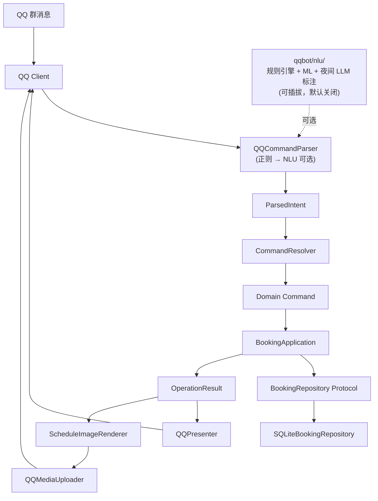

# QQBot v3.1.0 开发与维护手册

> 适用项目：果壳吉协琴房预约 QQ Bot  
> 适用版本：`3.1.0`  
> 基线归档：`QQBot-v3.1.zip`  
> 基线 SHA-256：`e141eb9abe25869c1453f7419d7d9265808c8f331302b3b197a84e67a2d6bd13`  
> 文档用途：开发交接、生产维护、Code Review，以及向后续 Vibe Coding / AI Agent 提供可靠上下文。

## 0. 给维护者和 AI 的最短说明

如果你只有几分钟，先记住下面十二条：

1. 这是一个多站点、单 QQ Bot 进程的预约系统。`yqh`、`yql`、`zgc` 各有配置和数据库，通过 `data/control.db` 把 QQ 群映射到站点。
2. 核心调用链是 `QQ Parser → Resolver → Command → BookingApplication → Repository → OperationResult → Presenter`。
3. `22:00` 是业务日边界，不是普通的自然日边界。22:00 后的 `+0` 指向自然日的次日。
4. Parser 不读数据库、不读当前时间、不判断权限；Resolver 才把房间、时间和日期表达式转换为绝对值。
5. 用户身份和角色必须来自 QQ `member_openid` 与数据库映射，绝不能从消息正文或 Web 请求字段中信任一个 `user_id`/`role`。
6. Application 是业务规则的唯一入口。未来新增网站也必须调用它，不能直接写 SQLite。
7. 动态冲突检查、每日累计限制和写入必须处于同一个 `BEGIN IMMEDIATE` 事务。
8. 时间在内部统一为当天零点起的分钟数，且只能落在 `00` 或 `30` 分钟。
9. 查询范围与预约权限是两回事。用户能查询未来 7 天，不代表能预约未来 7 天。
10. 普通预约允许“部分成功”：请求时段中被占用的部分会被剔除，其余空闲碎片会被写入。
11. v3.1.0 为每个开启图片功能的站点常驻一个 Chromium；图片失败必须回退到同一个 `OperationResult` 的文字呈示。
12. v3.1.0 的 QQ 分片上传实现假定分片编号从 `0` 开始；真实平台也可能返回从 `1` 开始的编号，这是已知缺陷，见“已知问题”。

### 0.1 AI 修改代码前必须遵守

把本节连同任务一起交给 AI：

```text
你正在维护 QQBot v3.1.0。修改前必须先阅读本手册及相关测试。

必须遵守：
1. 不得把 SQL、权限、业务日算法放进 Parser、Presenter 或 HTML 模板。
2. 不得信任客户端提供的 user_id、role、site_id 或 business_offset。
3. 所有依赖当前数据库状态的检查必须和写入位于同一个事务。
4. 不得改变 site_id、room.id、内部用户 UUID 的含义。
5. 不得删除旧表、生产 data/、.env、群绑定或用户数据。
6. 新增 Command 时同步修改 Parser/Resolver/Application/Result/Presenter/测试。
7. 新增 Result code 时同步补 Presenter 处理和测试。
8. 修改数据库必须提供幂等迁移、备份、验证与回滚路径。
9. 图片链路失败必须保留文字回退；不得记录 AppSecret、预签名 URL 或 file_info。
10. 修改完成后运行 pytest、ruff 和 compileall，并报告实际结果。

在动手前先说明：
- 请求经过哪些层；
- 计划修改哪些文件；
- 哪些不变量可能受影响；
- 需要新增哪些测试。
```

## 1. 系统定位与边界

### 1.1 系统负责什么

- 接收 QQ 群里的预约、取消、查询、绑定与管理员指令；
- 把 QQ 外部身份映射为系统用户 UUID；
- 根据站点配置执行房间解析、业务日换算、权限和时长限制；
- 在 SQLite 事务中处理冲突、预约、取消拆分和管理操作；
- 用文字或时间轴 PNG 呈示查询结果；
- 管理 QQ 群与站点配置的绑定；
- 从旧版表结构迁移用户、角色、预约、周常与锁定时段；
- 定时归档并清理 90 天以前的预约记录。

### 1.2 当前不负责什么

- 没有 Web API 或管理网站；
- NLP 为**实验性可选模块**（`qqbot/nlu/` 可插拔子包，默认关闭，见第 33 节），`ParsedIntent` 是它的接入点；
- 没有通用消息队列、Redis 或远程数据库；
- 没有对 `app_locked_slots` 的新增/删除指令，当前只会读取或迁移锁定时段；
- `app_audit_log` 已建表但当前代码没有写入；
- 不支持跨自然日的单条时段，例如 `23:00-01:00`；
- 不支持 15 分钟或任意分钟网格；
- 不允许一个进程中的站点使用不同 QQ AppID/Secret。

## 2. 总体架构

依赖方向应当始终由外向内：



允许的核心依赖关系：

```text
interfaces → application → domain
infrastructure → application/domain
presentation → domain + config
```

约束：

- `domain` 不得导入 QQ SDK、SQLite、YAML、Playwright 或文件系统；
- `application` 依赖 `BookingRepository` Protocol，不依赖 SQLite 具体实现；
- `interfaces/qq` 负责 QQ SDK 适配，不定义核心预约规则；
- `presentation` 只负责把已经算好的结果画出来；
- `infrastructure` 实现配置、SQLite 和群绑定等外部能力。

## 3. 目录与职责

```text
QQBot-v3.1/
├── main.py                              # 日志配置与进程入口
├── configs/
│   ├── yqh.yaml                         # 雁栖湖
│   ├── yql.yaml                         # 玉泉路
│   └── zgc.yaml                         # 中关村
├── qqbot/
│   ├── domain/
│   │   ├── calendar.py                  # 业务日
│   │   ├── models.py                    # 值对象、实体、Context、Result
│   │   ├── commands.py                  # 全部 Command
│   │   └── errors.py                    # 可呈示结构化异常
│   ├── application/
│   │   ├── ports.py                     # Repository Protocol
│   │   ├── resolver.py                  # Intent → 绝对 Command
│   │   └── service.py                   # 业务规则与 Dispatcher
│   ├── infrastructure/
│   │   ├── config.py                    # YAML → SiteConfig
│   │   ├── group_bindings.py            # 群 → bot_id
│   │   └── sqlite_repository.py         # Schema、迁移与事务实现
│   ├── interfaces/qq/
│   │   ├── parser.py                    # 文本 → ParsedIntent（可注入 NLU fallback）
│   │   ├── presenter.py                 # Result → 中文文字
│   │   ├── media_uploader.py            # QQ 富媒体分片上传
│   │   └── client.py                    # QQ 生命周期和总编排
│   ├── nlu/                             # NLP 可插拔子包（实验性，默认关闭，见第 33 节）
│   │   ├── __init__.py                  # 公共导出（挂载点）
│   │   ├── matcher.py                   # 规则引擎（模板→关键词→ML 三通道）
│   │   ├── classifier.py                # 零依赖朴素贝叶斯（字符 n-gram，JSON 模型）
│   │   ├── llm.py                       # DeepSeek 调用/脱敏/一致性投票
│   │   └── annotate.py                  # 夜间批处理编排（pending→投票→校验→候选库）
│   └── presentation/
│       ├── timeline.py                  # 时间轴 ViewModel 与 Playwright
│       └── templates/schedule.html.jinja
├── scripts/
│   ├── migrate.py                       # v2 → v3 迁移入口
│   ├── doctor.py                        # 只读健康检查
│   ├── bench_nlu.py                     # NLU 本地模拟与性能基准
│   ├── train_intent.py                  # NLU Phase 2 训练（交叉验证 + 阈值扫描）
│   ├── collect_samples.py               # NLU 日志样本收集
│   └── nightly_annotate.py              # 夜间 LLM 批处理标注 CLI（--dry-run 本地模拟）
├── deploy/qqbot.service.example         # systemd 示例
├── tests/                               # 领域、应用、Repository、QQ 测试
├── pyproject.toml
└── .env.example
```

## 4. 进程启动与生命周期

### 4.1 `main.py`

`main.py` 完成两件事：

1. `configure_logging(root)`：同时输出控制台日志与 `logs/qqbot.log`；日志按午夜轮转，保留 14 份。
2. 调用 `run_bot(project_root)`。

注意：代码没有导入 `python-dotenv`，也不会主动读取 `.env`。以下二者必须至少使用一种：

- 启动前 `source .env` 并导出变量；
- 使用 systemd 的 `EnvironmentFile=/opt/qqbot/.env`。

### 4.2 `run_bot(project_root)`

入口位于 `qqbot/interfaces/qq/client.py`：

1. 读取 `configs/*.yaml`；
2. 检查至少一份配置；
3. 检查 AppID/Secret；
4. 检查所有配置使用同一对凭证；
5. 创建 `PianoBotClient`；
6. 调用 QQ SDK 的 `client.run()`。

### 4.3 `PianoBotClient.__init__`

对每个 `bot_id` 创建：

- 一个 `SQLiteBookingRepository` 并立即 `initialize()`；
- 一个 `BookingApplication + Dispatcher`；
- 一个 `QQPresenter`；
- 若 `query.image_enabled=true`，一个 `ScheduleImageRenderer`。

同时初始化：

- `data/control.db` 中的 `GroupBindingStore`；
- 旧 `group_mappings.json` 的一次性增量导入；
- 一个共享的 `QQCommandParser` 和 `CommandResolver`。

### 4.4 `on_ready()`

- 为每个图片开启站点启动一个常驻 Chromium；
- 创建 `AsyncIOScheduler`；
- 每天 Asia/Shanghai 时间 `04:00` 运行历史预约归档清理；
- 按各站点功能开关挂载定时主动播报（见 5.2）。

图片渲染器启动失败不会阻止 Bot 运行，但该站点会回退文字。

### 4.5 `close()`

- 关闭所有 Chromium；
- 停止 scheduler；
- 调用 QQ SDK 的 `close()`。

前台运行时应使用 `Ctrl+C` 正常结束。`Ctrl+Z` 只会暂停进程；误按后用 `jobs`、`fg` 恢复，再按 `Ctrl+C`。

## 5. 一条 QQ 请求如何处理

`on_group_at_message_create(message)` 的真实顺序如下：

1. 读取 `message.content`；
2. 从 `message.author.member_openid` 建立 `ExternalIdentity("qq", openid)`；
3. Parser 生成 `ParsedIntent`；
4. 若是 `#绑定配置`，在群尚未绑定站点前走专用流程；
5. 从 `data/control.db` 取得该群的 `bot_id`；
6. 取得对应配置、Repository 和用户；
7. 只读取一次当前上海时间；
8. 根据静默窗口决定是否忽略普通指令；
9. 创建 `RequestContext`；
10. 用数据库角色调用 Resolver；
11. Dispatcher 调用 Application 并把 `AppError` 变为失败 Result；
12. 记录 `request_id/bot_id/user_id/operation/result`；
13. 查询结果优先生成图片并上传；
14. 图片任一步失败则用 Presenter 发送文字。

### 5.1 静默窗口的特殊规则

在 `silent_period` 内：

- 普通查询、取消、绑定和错误提示被忽略；
- 普通预约仍会执行，但不发送群消息；
- `#` 管理员指令不受静默影响；
- 静默不等于拒绝预约，它只是抑制回复，目的是减少抢单时刷屏。

默认窗口：

| 站点 | 静默窗口 |
| --- | --- |
| 雁栖湖 | 22:00–22:15 |
| 玉泉路 | 22:00–22:03 |
| 中关村 | 22:00–22:15 |

### 5.2 定时主动播报

实现集中在 `qqbot/interfaces/qq/broadcaster.py`：一个 `ProactiveSender` 主动推送通道
（遍历 `data/control.db` 群绑定表，向站点绑定的全部群发送主动消息）+ 三个相互独立的 Job。
Job 之间零共享状态，各按站点功能开关在 `on_ready` 挂载（`PianoBotClient._register_broadcast_jobs`）：

| Job | 时刻 | 内容 | 开关 |
| --- | --- | --- | --- |
| `RoutineBroadcastJob` | 每天 `booking.routine_broadcast.time`（默认 21:00） | 从明天起连续 `days` 天（默认 1，1～7）的周常占用，图片优先 | `features.broadcast` **且** `features.weekly_routine` |
| `ClockAnnounceJob` | 各站点 `silent_period.start` 时刻（默认 22:00） | 文字报时（系统时间 HH:MM:SS），解决抢琴房时间争议 | `features.clock_announce` |
| `SilentEndReportJob` | 各站点 `silent_period.end` 时刻（跨午夜同样支持） | 次日（自然日）预约情况，图片优先 | `features.silent_end_report` |

规则：

- 三个 Job 的时刻全部来自 YAML（`booking.routine_broadcast.time`、`silent_period.start/end`），
  改配置即生效，代码零硬编码；
- 播报目标统一为「自然日次日」：周常播报从明天起连续 days 天（抢琴房高峰之前播报，
  便于用户提前规划）；静默期结束时业务日已是次日，「次日」即当晚 22:00 抢到的琴房所在日；
- 查询结果统一经 `BookingApplication.daily_schedule / routine_schedule` 构造
  （无身份系统读操作，跳过身份/权限校验——调用方是定时任务而非用户，只读不进事务）；
- 图片链路失败自动回退同一结果的文字呈示（与普通查询同一回退原则）；
- 主动消息不受被动回复 5 分钟有效期限制；单群发送失败只记日志，不影响其余群；
- 腾讯主动消息频控（群聊：未认证 30/qpm、单群 20/qpm、每日 1000 条/群）对每日三条播报绰绰有余；
- 报时受主动消息链路延迟影响（通常秒级，官方无 SLA）：cron 按时触发，文案携带触发时刻的
  系统时间戳作为对时基准，不提前补偿（延迟不可控，提前反而误导）。

## 6. 业务日、日期范围与时间

### 6.1 业务日定义

`BusinessCalendar.business_date(now)`：

```text
若上海本地时间 < 22:00：业务日 = 今天
若上海本地时间 >= 22:00：业务日 = 明天
```

因此：

| 接收时间 | `+0` | `+1` | `+2` |
| --- | --- | --- | --- |
| 2026-08-07 21:59 | 08-07 | 08-08 | 08-09 |
| 2026-08-07 22:00 | 08-08 | 08-09 | 08-10 |

这是整个项目最重要的不变量之一。任何入口都应把 `received_at` 传给同一个 `BusinessCalendar`，不能使用 `date.today()` 重写。

### 6.2 相对日期与绝对日期

- `+N`：相对业务日；
- `YYYY-MM-DD`：绝对自然日期，不经过 22:00 换算；
- 查询范围支持 `+0~+6` 或 `2026-08-10~2026-08-16`；
- 范围两端不能混用相对日期和绝对日期；
- 查询范围最多由 `query.max_range_days` 限制，当前强制 1–7 天。

重要区别：

- `booking.max_query_offset=2` 实际用于预约、取消及部分管理员相对日期指令的单日偏移解析；
- 普通查询范围不受 `max_query_offset` 限制，只受 `query.max_range_days` 限制；
- 所以 `/查询 +100~+106` 在语法和 Resolver 层仍可能合法；
- 查询未来日期不赋予对应预约权限。

### 6.3 时间格式

`parse_time()` 接受：

| 输入 | 内部分钟 |
| --- | ---: |
| `7` | 420 |
| `7.0` | 420 |
| `7.5` | 450 |
| `07:30` | 450 |
| `24:00` | 1440 |

拒绝：

- `7.25`；
- `21:03`；
- `21:60`；
- `24:30`；
- 结束不晚于开始；
- 跨越自然日的范围。

`TimeRange` 自身再次保证：

```text
0 <= start < end <= 1440
start % 30 == 0
end % 30 == 0
```

## 7. 用户指令参考

前导 `/` 可以省略。Parser 也兼容一部分没有空格的写法，例如 `预约7-8.5`。

### 7.1 普通指令

| 指令 | 语义 | 备注 |
| --- | --- | --- |
| `/绑定 姓名 学号` | 绑定或更新当前 QQ 身份对应用户 | 姓名须 1–10 个汉字 |
| `/预约 [琴房] 7-8.5 [+N]` | 预约目标业务日时段 | 单房间站点可省略琴房；缺省 `+0` |
| `/取消 [+N]` | 取消本人目标业务日全部预约 | 缺省 `+0` |
| `/取消 [琴房] 7-8.5 [+N]` | 取消本人匹配时段 | 可能拆分原预约 |
| `/查询 [琴房]` | 按角色缺省范围查询占用 | 结果优先图片 |
| `/查询 [琴房] +1` | 查询一个相对业务日 | 与预约权限无关 |
| `/查询 [琴房] +0~+6` | 查询相对范围 | 含首尾 |
| `/查询 [琴房] YYYY-MM-DD~YYYY-MM-DD` | 查询绝对日期范围 | 最多 7 天 |
| `/空闲 ...` | 与查询相同的日期语法 | 返回空闲片段 |
| `/查询个人` | 查询本人从当前业务日起的全部后续预约 | 没有 7 天限制 |

旧的“超前预约、超前查询、超前取消、远期预约、远期取消”不会进入第二套逻辑，只返回迁移提示。

### 7.2 管理员指令

`#` 是“管理员语法标记”，不是权限本身。Parser 会将 `admin=True`，但 Application 仍通过数据库角色检查权限。

| 指令 | Command/操作 | 权限与说明 |
| --- | --- | --- |
| `#绑定配置 yql` | 群绑定站点 | 必须是目标站点最高角色 `owner` |
| `#添加管理 姓名 [角色]` | `AssignRole` | 至少 admin；只能授予低于自己且高于 user 的角色 |
| `#删除管理 姓名` | `RemoveRole` | 不能删除同级或更高角色 |
| `#转让群主 姓名` | `TransferOwner` | 只有最高角色可执行 |
| `#取消 琴房 21-22.5 +1` | `AdminCancel` | 强制取消该范围内所有用户预约 |
| `#取消 琴房 21-22.5 YYYY-MM-DD` | `AdminCancel` | 支持绝对日期 |
| `#查询 YYYY-MM-DD [琴房]` | `QuerySchedule(admin_view=True)` | 显示完整预约人姓名 |
| `#清空预约 [+1/日期]` | `ClearReservations` | 只清预约，不清周常和锁定 |
| `#撤销清空 [+1/日期]` | `UndoClearReservations` | 恢复该日最近一次 clear 批次 |
| `#添加周常 周一 琴房 21-22.5 用途` | `AddRoutine` | 需站点开启 `weekly_routine` |
| `#删除周常 周一 琴房 21-22.5` | `RemoveRoutine` | 必须完全匹配 |
| `#查询周常 [周一]` | `ListRoutines` | 可查全部或指定星期 |
| `#播报周常` | `BroadcastRoutines` | 查询自然日次日的周常；需 `broadcast` |
| `#锁定 琴房 21-22.5 [+1/日期] 用途` | `AddLock` | 单日临时锁定；与预约/锁定重叠拒绝；**允许覆盖周常**并在回执中提示被覆盖的周常 |
| `#解锁 琴房 21-22.5 [+1/日期]` | `RemoveLock` | 必须完全匹配；用途不允许出现 |
| `#备份用户` | `BackupUsers` | 覆盖固定 CSV 备份文件 |
| `#恢复用户` | `RestoreUsers` | 只补缺失记录，不覆盖已有记录 |

管理员命令中的绝对日期可以超出普通 `+0/+1/+2`。这就是远期管理操作的正式入口，不应把权限含义塞进 `+N` 本身。

## 8. 角色、权限与站点差异

### 8.1 角色等级

常见等级：

```text
user=0 < band=1 < admin=2 < owner=3
```

雁栖湖没有 `band`；玉泉路和中关村有 `band`。

`admin_level` 默认读取角色名 `admin` 的等级，缺失时回退为 `2`。`highest_role` 是配置中等级最大的角色。

### 8.2 提前预约

| 站点 | user | band | admin | owner | feature |
| --- | ---: | ---: | ---: | ---: | --- |
| 雁栖湖 | +0 | — | +0 | +0 | `advance_booking=false` |
| 玉泉路 | +0 | +1 | +2 | +2 | `true` |
| 中关村 | +0 | +1 | +2 | +2 | `true` |

Application 会重新计算 `actual_offset` 并检查它和 Command 的 `business_offset` 是否一致。因此未来 Web 接口不能伪造“日期是大后天但 offset=0”。

### 8.3 预约时长

限制根据“请求收到的上海本地时间”选择，而不是根据预约目标时段：

```text
regular_start <= 收到时间 < rush_start  → regular 限制
其他时间                                → rush 限制
```

默认配置：

| 站点 | 07:00–22:00 单次/每日 | 其他时间单次/每日 |
| --- | --- | --- |
| 雁栖湖 | 24h / 24h | 1.5h / 1.5h |
| 玉泉路 | 1.5h / 1.5h | 1.5h / 1.5h |
| 中关村 | 24h / 24h | 1.5h / 1.5h |

注意：在当前算法中，07:00 以前也使用 rush 限制。

### 8.4 查询缺省范围

| 角色 | 玉泉路/中关村 | 雁栖湖 |
| --- | --- | --- |
| user | `+0~+0` | `+0~+0` |
| band | `+0~+1` | 无此角色 |
| admin | `+0~+6` | `+0~+6` |
| owner | `+0~+6` | `+0~+6` |

角色来自 Repository，用户不能在指令中声明自己的角色。

## 9. Domain 接口

### 9.1 值对象与数据模型

| 类型 | 关键字段 | 不变量/用途 |
| --- | --- | --- |
| `TimeRange` | `start`, `end` | 分钟制、半小时网格、不可跨日；提供 `overlaps/clipped_to/display` |
| `DateRange` | `start`, `end` | 首日不晚于末日；`day_count` 含首尾；`dates()` 展开 |
| `ExternalIdentity` | `provider`, `external_id` | 当前 provider 为 `qq`；未来可扩 Web/校园身份 |
| `User` | `id`, `display_name`, `student_id` | `id` 为稳定系统 UUID |
| `Room` | `id`, `site_id`, `name`, `aliases` | `id` 与 `site_id` 稳定，名称/别名可改 |
| `RequestContext` | `request_id`, `source`, `site_id`, `identity`, `actor_user_id`, `received_at` | 每个请求的可信上下文 |
| `Occupancy` | `room_id`, `time_range`, `kind`, `label`, `user_id` | kind 为 reservation/routine/lock |
| `CancelledSlot` | `room_id`, `time_range`, `user_name` | 取消操作的结构化回执 |
| `Routine` | `id`, `weekday`, `room_id`, `time_range`, `purpose` | weekday 为 0–6 |
| `OperationResult` | `ok`, `code`, `data` | 跨入口稳定返回协议 |

### 9.2 Command 清单

| Command | 字段 |
| --- | --- |
| `BindUser` | `display_name`, `student_id` |
| `CreateReservation` | `room_id`, `reserve_date`, `time_range`, `business_offset` |
| `CancelReservation` | `reserve_date`, `business_offset`, `room_id?`, `time_range?` |
| `QuerySchedule` | `date_range`, `first_business_offset?`, `room_id?`, `admin_view` |
| `QueryFreeSlots` | `date_range`, `first_business_offset?`, `room_id?` |
| `QueryPersonal` | `from_date` |
| `AssignRole` | `target_name`, `role?` |
| `RemoveRole` | `target_name` |
| `TransferOwner` | `target_name` |
| `AdminCancel` | `reserve_date`, `room_id`, `time_range` |
| `ClearReservations` | `reserve_date` |
| `UndoClearReservations` | `reserve_date` |
| `AddRoutine` | `weekday`, `room_id`, `time_range`, `purpose` |
| `RemoveRoutine` | `weekday`, `room_id`, `time_range` |
| `ListRoutines` | `weekday?` |
| `BroadcastRoutines` | `target_date` |
| `AddLock` | `room_id`, `reserve_date`, `time_range`, `label` |
| `RemoveLock` | `room_id`, `reserve_date`, `time_range` |
| `BackupUsers` | 无字段 |
| `RestoreUsers` | 无字段 |

Command 必须只包含已经解析完成的绝对业务数据；不能把原始 QQ 文本塞进 Application。

### 9.3 结构化异常

`AppError(code, details)` 可以安全转为用户可见 Result：

| 异常 | code | 典型 details |
| --- | --- | --- |
| `ParseError` | `parse_error` | `usage` |
| `NotRegistered` | `not_registered` | — |
| `PermissionDenied` | `permission_denied` | `required/reason` |
| `AdvanceBookingDenied` | `advance_booking_denied` | requested/maximum offset |
| `InvalidTimeRange` | `invalid_time_range` | `reason` |
| `DailyLimitExceeded` | `daily_limit_exceeded` | current/maximum minutes |
| `DuplicateIdentity` | `duplicate_identity` | `field` |
| `NotFound` | `not_found` | `entity` 与附加原因 |
| `FeatureDisabled` | `feature_disabled` | `feature` |
| `DatabaseBusy` | `database_busy` | — |

不可预期异常不应冒充业务错误；QQ Client 会记录堆栈并返回 `internal_error`。

## 10. Parser 与 Resolver 接口

### 10.1 `ParsedIntent`

```python
ParsedIntent(
    operation: str,
    arguments: dict[str, Any],
    admin: bool = False,
)
```

这是规则 Parser、NLU 模块（`qqbot/nlu/`，见第 33 节）和未来 Web 表单解析器之间的稳定中间协议。

### 10.2 `QQCommandParser.parse(raw_text)`

职责：

- 去掉可选 `/` 与管理员 `#`；
- 识别动作；
- 提取房间文字、时间文字、日期文字、角色文字；
- 返回 `ParsedIntent`；
- 对格式错误抛 `ParseError`。

禁止承担：

- 查房间 ID；
- 读取当前时间；
- 计算 `+N`；
- 查用户、角色或数据库；
- 判断业务权限。

### 10.3 `CommandResolver.resolve(intent, config, now, actor_role="user")`

职责：

- 使用 `BusinessCalendar` 把偏移转换为绝对日期；
- 解析绝对日期与查询范围；
- 将房间名称/别名解析为稳定 `room_id`；
- 将时间文本解析为分钟制 `TimeRange`；
- 将星期文本解析为 0–6；
- 根据可信 `actor_role` 选择查询缺省范围；
- 返回具体 Command。

Resolver 不执行数据库冲突检查，也不最终授权预约。Application 会再次检查关键规则。

## 11. Application Service 接口与规则

### 11.1 `BookingApplication`

构造：

```python
BookingApplication(config: SiteConfig, repository: BookingRepository)
```

唯一业务入口：

```python
execute(context: RequestContext, command: Command) -> OperationResult
```

主要私有辅助方法：

- `_actor(context)`：要求已注册并返回内部用户 ID；
- `_role(context)`：从 Repository 查询角色；
- `_require_admin(context)`：比较角色等级；
- `_room_name(room_id)`：呈示用房间名；
- `_bind(context, command)`：绑定格式和年份验证。

无身份系统读操作（定时播报用，见 5.2；只读、不进写事务）：

- `daily_schedule(target_date, room_id=None)`：单日 `schedule_range`，含全部占用；
- `routine_schedule(target_date)`：单日 `schedule_range`，仅含周常占用。

### 11.2 `Dispatcher`

```python
dispatch(context, command) -> OperationResult
```

Dispatcher 只捕获 `AppError` 并转为失败 Result。它不会捕获全部 Python 异常；未知异常由外层 Client 记录。

### 11.3 预约算法

`CreateReservation` 的校验顺序：

1. 验证 `room_id` 存在；
2. 根据 `received_at` 重新计算实际业务偏移；
3. 禁止过去业务日；
4. 检查绝对日期与 Command 偏移一致；
5. 读取可信角色及最大偏移；
6. 检查开放时间；
7. 根据收到请求的时刻选择 regular/rush 限制；
8. 检查单次时长；
9. Repository 在写事务中计算空闲碎片、检查每日累计并写入；
10. 返回完整成功、部分成功或不可用。

### 11.4 部分成功语义

假设申请 `07:00–09:00`，其中 `07:30–08:00` 已被占用：

```text
成功写入：07:00–07:30、08:00–09:00
Result：reservation_partially_created
```

这不是“遇到任一冲突就全部失败”。若产品策略要改成全有或全无，必须同时修改 Repository 行为、Application Result、Presenter 和冲突测试。

### 11.5 取消语义

- `room_id=None, time_range=None`：软删除本人该业务日全部预约；
- 具体范围取消：只处理本人预约，并可能把一条原预约拆成前后两条；
- 如果请求范围与其他用户的预约重叠，普通取消会拒绝，避免用户用大范围误触他人；
- 管理员取消可以同时取消范围内多个用户，并在回执中带原预约人。

### 11.6 查询语义

- 普通 `/查询` 返回 `schedule_range`，每一天含 `occupancies`；
- 普通 `/空闲` 返回 `free_slots_range`，每一天、每个房间含空闲片段；
- `#查询` 返回单日 `schedule` 且 `admin_view=True`；
- `/查询个人` 从当前业务日起查询本人所有未来有效预约，没有 7 天限制。

普通查询只显示预约人名称最后四个字符；管理员查询显示完整名称。周常和锁定显示完整用途/标签。

## 12. OperationResult 协议

以下字段是 Presenter、图片渲染器和未来 Web Presenter 的契约。修改字段时必须同步修改所有消费者。

### 12.1 成功/业务结果

| code | ok | data 关键字段 |
| --- | --- | --- |
| `user_bound` | true | `user: User` |
| `reservation_created` | true | `date`, `offset`, `room_name`, `requested`, `fragments` |
| `reservation_partially_created` | true | 同上 |
| `reservation_unavailable` | false | `date`, `offset`, `room_name`, `requested` |
| `reservation_cancelled` | true | `date`, `offset`, `slots` |
| `nothing_to_cancel` | true | `date`, `offset`, `slots` |
| `schedule` | true | `date`, `offset`, `occupancies`, `admin_view` |
| `schedule_range` | true | `date_range`, `room_ids`, `days[]` |
| `free_slots_range` | true | `date_range`, `room_ids`, `days[]` |
| `personal_schedule` | true | `reservations: list[(date, room_id, TimeRange)]` |
| `role_assigned` | true | `target`, `role` |
| `role_removed` | true | `target` |
| `owner_transferred` | true | `target`, `fallback_role` |
| `admin_cancelled` | true | `date`, `slots` |
| `date_cleared` | true | `date`, `count` |
| `clear_undone` | true | `date`, `count` |
| `routine_added` | true | `routine` |
| `routine_removed` | true | — |
| `routine_not_found` | true | — |
| `routines` | true | `routines`, `weekday` |
| `routine_broadcast` | true | `date`, `routines` |
| `users_backed_up` | true | `count`, `path` |
| `users_restored` | true | `count` |

说明：`reservation_unavailable` 使用 `OperationResult.failure()`；`nothing_to_cancel` 等“没有变化但不是系统错误”的结果使用 success。

### 12.2 失败结果

| code | data 关键字段 |
| --- | --- |
| `parse_error` | `usage` 及可能的 `maximum/requested` |
| `not_registered` | — |
| `permission_denied` | 可选 `required/reason/role` |
| `advance_booking_denied` | `requested_offset`, `maximum_offset` |
| `invalid_time_range` | `reason` |
| `daily_limit_exceeded` | `current_minutes`, `maximum_minutes` |
| `duplicate_identity` | `field` |
| `invalid_name` | — |
| `invalid_student_id` | — |
| `invalid_student_year` | `year`, `maximum` |
| `database_busy` | — |
| `feature_disabled` | `feature` |
| `not_found` | `entity` 与具体原因 |
| `internal_error` | `request_id` |

## 13. Repository Port

`BookingRepository` 是 Application 和持久化实现之间的接口。未来接 PostgreSQL 时，应实现同一语义，而不是修改 Application 去理解两种数据库。

| 方法 | 返回 | 事务/语义 |
| --- | --- | --- |
| `initialize()` | `None` | 建表、房间同步、旧表迁移、初始 owner |
| `user_by_external(identity)` | `User?` | 外部身份查用户 |
| `bind_user(identity, name, student_id)` | `User` | 新建或更新；姓名/学号全局去重 |
| `user_by_name(name)` | `User?` | 多条同名时视为 ambiguous |
| `role_of(user_id)` | `str` | 无记录默认 `user` |
| `set_role(user_id, role)` | `None` | upsert |
| `remove_role(user_id)` | `None` | 删除后回退 user |
| `transfer_role(...)` | `None` | 同事务降级旧 owner、升级新 owner |
| `book_available(...)` | `list[TimeRange]` | 原子冲突检查、每日限制和写入 |
| `cancel_user(...)` | `list[CancelledSlot]` | 全日软删或范围拆分 |
| `cancel_admin(...)` | `list[CancelledSlot]` | 范围内多用户软删/拆分 |
| `schedule(date, room_id?)` | `list[Occupancy]` | 合并预约、周常、锁定 |
| `free_slots(date, room_ids, opening)` | `dict[room_id, slots]` | 对占用求补集 |
| `personal(user_id, from_date)` | `list[(date, room_id, range)]` | 只查有效预约 |
| `clear_date(date, actor_id)` | `int` | soft delete 该日全部预约 |
| `undo_clear(date, actor_id)` | `int` | 恢复该日最近 clear 批次 |
| `add_routine(...)` | `Routine` | 检查周常和未来已有预约冲突 |
| `remove_routine(...)` | `bool` | 完全匹配删除 |
| `list_routines(weekday?)` | `list[Routine]` | 排序返回 |
| `add_lock(...)` | `(LockedSlot, list[CoveredRoutine])` | 单日临时锁定；与同日同房间的锁定/预约重叠拒绝；周常允许被覆盖并返回覆盖片段 |
| `remove_lock(...)` | `bool` | 完全匹配删除 |
| `backup_users()` | `(Path, count)` | 写固定 CSV |
| `restore_users()` | `count` | insert-or-ignore |
| `cleanup_old(cutoff)` | `count` | 先 CSV 归档再物理删除 |

当前 `clear_date/undo_clear` 接收 `actor_id`，但实现没有使用它；`app_audit_log` 也没有写入。这是待补的审计能力，不应误以为现有系统已经记录清空操作者。

## 14. SQLite 实现与事务

### 14.1 连接设置

每次连接设置：

```sql
PRAGMA foreign_keys=ON;
PRAGMA journal_mode=WAL;
PRAGMA busy_timeout=10000;
```

写操作使用：

```sql
BEGIN IMMEDIATE;
```

这会在读取冲突状态前取得写保留锁，使两个并发预约者不能同时看到同一空闲时段并都写入。

SQLite 的 locked/busy 会映射为 `DatabaseBusy`；其他 `OperationalError` 不应被吞掉。

### 14.2 空闲算法

`_merge(ranges)` 先合并重叠或相邻的占用；`_available_parts(requested, occupied)` 再计算申请范围对占用并集的补集。

占用来源包括：

- 有效预约；
- 指定日期的临时锁定；
- 目标日期星期对应的周常。

### 14.3 软删除和拆分

`app_reservations.deleted_at IS NULL` 代表有效预约。

范围取消时：

1. 原记录写入 `deleted_at/delete_batch_id`；
2. 被取消范围加入返回值；
3. 未取消的头部、尾部各写成新的有效预约记录。

因此不要通过“原预约 ID 是否仍存在”判断一个时段是否有效，应始终查询 `deleted_at IS NULL`。

### 14.4 清空和撤销

- 清空批次 ID 形如 `clear:<uuid>`；
- 普通取消批次 ID 形如 `cancel:<uuid>`；
- 撤销只找指定日期最近的 `clear:%` 批次；
- 撤销不会恢复普通用户取消批次；
- 当前没有检查恢复后是否与新增预约冲突，维护者修改该流程时必须考虑这一点。

## 15. 数据库 Schema

### 15.1 `app_meta`

| 字段 | 说明 |
| --- | --- |
| `key` PK | 元数据键 |
| `value` | 元数据值 |

当前关键标记：`legacy_import_v1`。

### 15.2 `app_users`

| 字段 | 说明 |
| --- | --- |
| `id` PK | 系统用户 UUID |
| `display_name` | 中文姓名 |
| `student_id` | 学号，可空 |
| `created_at/updated_at` | ISO 时间 |

姓名和学号有普通索引，但数据库层没有 UNIQUE；去重在写事务中执行。

### 15.3 `app_identities`

| 字段 | 说明 |
| --- | --- |
| `provider + external_id` PK | 外部身份唯一键 |
| `user_id` | 关联 `app_users.id` |

这是未来增加 Web/校园统一认证的扩展点。

### 15.4 `app_roles`

| 字段 | 说明 |
| --- | --- |
| `site_id + user_id` PK | 每站点每用户一条角色 |
| `role` | 配置中的角色名 |

没有记录即视为 `user`。

### 15.5 `app_rooms`

| 字段 | 说明 |
| --- | --- |
| `id` PK | 稳定房间 ID |
| `site_id` | 稳定站点 ID |
| `name` | 展示名称 |
| `active` | 当前配置房间为 1；未知旧房间可为 0 |

### 15.6 `app_reservations`

| 字段 | 说明 |
| --- | --- |
| `id` PK | 预约 UUID |
| `site_id` | 站点 |
| `user_id` | 用户 |
| `room_id` | 房间 |
| `reserve_date` | `YYYY-MM-DD` |
| `start_min/end_min` | 半小时网格分钟数 |
| `source` | `qq/web/system/legacy` |
| `created_at` | 创建时间 |
| `deleted_at` | 软删除时间，NULL 为有效 |
| `delete_batch_id` | cancel/clear 批次 |

重要索引：有效时段索引、有效用户日期索引。

### 15.7 `app_weekly_routines`

保存 `weekday(0–6) + room + range + purpose`。周常不会每天复制成预约，而是在查询和冲突检查时按星期投影。

### 15.8 `app_locked_slots`

保存指定日期的锁定区间（单日临时占用，不重复）。通过 `#锁定` / `#解锁` 管理指令
（`AddLock` / `RemoveLock`）读写；会参与占用查询、空闲计算和新预约冲突。

### 15.9 `app_audit_log`

预留审计表，字段包括 actor、action、entity、payload 和时间。当前没有任何写入代码。

### 15.10 `app_migration_issues`

保存无法自动迁移的旧记录及原因。`scripts.doctor` 发现任意记录都会返回失败状态。

### 15.11 `data/control.db`

独立表：

```sql
group_bindings(
    group_id TEXT PRIMARY KEY,
    bot_id TEXT NOT NULL,
    updated_at TEXT
)
```

它决定某个 QQ 群使用哪个站点。不要把它与任一站点预约数据库合并处理或遗漏备份。

## 16. 配置接口

### 16.1 环境变量

| 变量 | 必需 | 说明 |
| --- | --- | --- |
| `QQBOT_APPID` | 是 | QQ Bot AppID |
| `QQBOT_SECRET` | 是 | QQ Bot Secret |
| `PLAYWRIGHT_BROWSERS_PATH` | 推荐 | Chromium 安装路径；安装和运行必须一致 |
| `DEEPSEEK_API_KEY` | NLU 夜间标注时 | DeepSeek API Key；缺失则不挂载 04:30 夜间标注任务（见第 33 节） |
| `DEEPSEEK_MODEL` | 否 | 夜间标注模型名，默认 `deepseek-chat`（非思考模式，见第 33 节） |

`.env` 不会由程序自动加载。

### 16.2 YAML 顶层字段

| 路径 | 含义 |
| --- | --- |
| `bot_id` | 配置选择键，例如 yql；必须唯一 |
| `site_id` | 数据中的稳定站点 ID；上线后不要修改 |
| `bot_name` | 展示名称 |
| `credentials.appid_env/secret_env` | 凭证环境变量名 |
| `database.path` | 相对项目根目录或绝对路径 |
| `rooms[]` | 房间 ID、名称、别名 |
| `default_owner_external_id` | 初始 owner 的 QQ 外部 ID |
| `roles.levels` | 角色与整数等级 |
| `booking.*` | 开放时间、业务日、偏移、静默、时长 |
| `booking.routine_broadcast.time/days` | 周常定时播报时刻与天数（1～7，见 5.2） |
| `features.*` | advance/routine/broadcast/nlu_enabled/clock_announce/silent_end_report 开关（nlu_enabled 见第 33 节，定时播报见 5.2） |
| `query.*` | 最大天数、图片、按角色缺省范围 |

### 16.3 房间配置

```yaml
rooms:
  - id: yql-main
    name: 玉泉路琴房
    aliases: [玉泉路, 玉泉路排练室]
```

规则：

- `id` 在当前配置中必须唯一；
- 解析不区分英文大小写；
- 单房间站点可以省略房间；
- 多房间站点省略会返回 room_required；
- 改展示名应保留旧名称为 alias；
- 已上线后不要修改 `id`，否则旧预约会指向另一房间或成为不可识别记录。

### 16.4 查询配置

```yaml
query:
  max_range_days: 7
  image_enabled: true
  default_ranges:
    user: [0, 0]
    band: [0, 1]
    admin: [0, 6]
    owner: [0, 6]
```

校验：

- 最大范围必须为 1–7；
- 每个缺省范围必须满足 `0 <= start <= end`；
- 含首尾天数不能超过最大范围。

## 17. QQ 接口适配

### 17.1 文本消息

`_send()` 调用：

```python
post_group_message(
    group_openid=...,
    msg_type=0,
    msg_id=原消息 ID,
    content=文本,
)
```

### 17.2 图片消息

图片上传成功后调用：

```python
post_group_message(
    group_openid=...,
    msg_type=7,
    msg_id=原消息 ID,
    media={"file_info": "..."},
)
```

`file_info` 是临时、不透明的平台数据，只用于紧随其后的发送，不应落库或写日志。

### 17.3 富媒体上传流程

`QQMediaUploader.upload_image(group_openid, content, file_name)`：

1. 拒绝空文件和超过 200MB 的文件；
2. 计算 MD5、SHA1、前 10,002,432 字节 MD5；
3. `POST /v2/groups/{group_openid}/upload_prepare`；
4. 逐片 PUT 到服务端返回的预签名 URL；
5. 每片调用 `upload_part_finish`；
6. 调用 `/files` 合并；
7. 返回 `{file_info}`。

PUT 每片最多尝试 3 次，单次总超时 300 秒，重试间隔被限制到 0–10 秒。

当前通过 `api._http.request` 使用 qq-botpy 私有属性，并通过自定义 `Route` 强制域名 `api.bot.qq.com`。升级 qq-botpy 时必须优先测试这一层。

严禁记录：

- AppSecret；
- 预签名 URL；
- 完整 `file_info`；
- 上传请求中的临时凭证。

## 18. Chromium 图片渲染

### 18.1 ViewModel

`build_timeline_view(config, result)` 只接受：

- `schedule_range`；
- `free_slots_range`。

它生成：

- 标题、日期区间、开放时间；
- 小时刻度与百分比位置；
- 按日期 × 房间展开的 rows；
- reservation/routine/lock/free blocks；
- 预约人脱敏标签。

模板只负责布局，不得重新计算业务日、权限、空闲或冲突。

### 18.2 `ScheduleImageRenderer`

生命周期：

- `start()`：启动 Playwright runtime 和 Chromium；
- `available`：`_browser is not None`；
- `render_html(result, theme=None)`：Jinja2 自动转义；`theme` 缺省时由 `current_theme()` 按上海时区判定（19:00～次日 07:00 深色，其余浅色），模板以 `body.theme-light/dark` 切换 CSS 变量配色；
- `render(result)`：新建 Page、设置 HTML、执行 `_fit_row_heights`（同行块等高、整行随换行内容变高）、截图 `#schedule`、关闭 Page；
- `close()`：关闭 Browser 和 Playwright。

v3.1.0 每个开启图片的站点各有一个 renderer，所以三个站点默认会启动三个 Browser 实例。Browser 常驻，Page 按查询创建和关闭。

样式要点（Soft Flat 设计语言，详见 `docs/QUERY_IMAGES.md`）：

- 模板目录 `templates/fonts/*.woff2` 由渲染器内联为 data URI（`{{ font_400 }}` / `{{ font_700 }}`），无系统字体服务器也能渲染中文；
- 按日期交替行底色（`day_alt`），同行块等高且时间统一固定在块底部左下角；
- 块内名字 13px 固定、允许换行，不压缩字号、不出现省略号。

### 18.3 文字回退

以下任一步失败都必须回退：

- Browser 未启动；
- HTML/截图失败；
- 预上传失败；
- 分片 PUT/确认失败；
- 文件合并失败；
- 富媒体消息发送失败。

回退必须呈示原来的同一个 `OperationResult`，不能重新执行查询或预约。

## 19. 用户绑定与初始 owner

### 19.1 普通绑定

姓名：

- 1–10 个字符；
- 必须全部是基本汉字范围 `\u4e00-\u9fff`。

学号：

- `4位年份 + 大写字母 + 10位数字`；或
- `15位数字`；
- 前四位年份必须处于 2018 到当前上海年份之间。

同一站点数据库中，姓名和学号不能被其他系统用户占用。

### 19.2 初始 owner

Repository 初始化时，如果配置了 `default_owner_external_id`：

1. 为该 QQ 外部 ID 创建/查找“系统管理员”用户；
2. 检查站点是否已有最高角色；
3. 仅在没有最高角色时授予 owner。

因此修改 `default_owner_external_id` 不会自动夺走现 owner 的权限。

## 20. 周常、锁定与空闲

### 20.1 周常

- 保存为每周规则，而不是每日预约；
- 添加时检查同星期、同房间的周常冲突；
- 添加时还检查从当前业务日起所有已有未来预约；
- 一旦存在冲突就拒绝添加，不会自动取消已有预约；
- 普通预约会把对应星期的周常视为占用。

当前只有雁栖湖开启 `weekly_routine` 与 `broadcast`（定时周常播报要求两者同时开启，见 5.2）。

### 20.2 锁定

`app_locked_slots` 会参与：

- 占用查询；
- 空闲计算；
- 新预约冲突。

管理入口为 `#锁定` / `#解锁`（`AddLock` / `RemoveLock`，见 7.2）：单日临时占用，
不按周重复，适合一次性活动。`AddLock` 校验：房间存在、日期非过去业务日、时段在开放
时间内；与同日同房间的已有**预约、锁定**重叠时拒绝（`NotFound(lock_slot)`），
与**周常重叠允许**——锁定优先于周常：当日被锁定覆盖的周常区间在查询、空闲计算中
让位给锁定，回执里提示被覆盖的周常（`covered` 列表，含用途、原时段、重叠部分）；
`#解锁` 后周常自动恢复显示，无需其他操作。

### 20.3 空闲

空闲 = 配置开放区间减去以下并集：

- 有效预约；
- 当日锁定；
- 当周周常。

相邻占用会先合并，因此不会输出零长度或重复碎片。

## 21. 备份、迁移与历史清理

### 21.1 必须备份的生产数据

至少包括：

```text
data/
├── control.db
├── yqh/piano_room_yqh.db
├── yql/piano_room_yql.db
└── zgc/piano_room_zgc.db
.env
configs/
group_mappings.json（若仍保留）
```

SQLite 使用 WAL 时，在线复制单个 `.db` 可能得到不一致快照。推荐停服后复制，或使用 SQLite backup API/`.backup`。

### 21.2 v2 → v3

`scripts.migrate`：

1. 为每个数据库生成 `.pre_v3_<timestamp>.bak`；
2. `initialize()` 新表；
3. 导入旧表；
4. `PRAGMA quick_check`；
5. 输出有效预约和迁移问题数量；
6. 导入旧群映射。

旧表不会删除。导入由 `app_meta.legacy_import_v1` 保证幂等。

旧时间不是 00/30 网格时，记录不会静默丢失，而会写入 `app_migration_issues`。

### 21.3 `scripts.doctor`

只读检查：

- 配置与凭证是否加载；
- 数据库是否存在；
- `PRAGMA quick_check`；
- v3/旧预约数；
- 迁移问题数。

有数据库损坏或迁移问题时退出码为 1。

### 21.4 用户 CSV 备份

`#备份用户` 写入：

```text
<站点数据库目录>/backups/users_backup_v3.csv
```

每次覆盖同一个文件。它只备份用户、外部身份和角色，不备份预约、群映射、周常和锁定，因此不能代替完整数据库备份。

### 21.5 90 天归档

每天 04:00：

1. 选择 `reserve_date < 今天 - 90天` 的所有预约，包括软删除记录；
2. 写入带时间戳的 CSV；
3. 成功落盘后物理删除数据库记录。

归档目录：`<数据库目录>/archives/`。

## 22. 部署与日常运维

### 22.1 首次安装

```bash
cd /opt/qqbot
python3 -m venv .venv
.venv/bin/python -m pip install -e '.[dev]'

cp .env.example .env
set -a
source .env
set +a

.venv/bin/python -m playwright install chromium
```

缺系统依赖时：

```bash
sudo .venv/bin/python -m playwright install-deps chromium
```

安装 Browser 和启动 Bot 时，Linux 用户及 `PLAYWRIGHT_BROWSERS_PATH` 必须一致。

### 22.2 前台检查

```bash
set -a
source .env
set +a
.venv/bin/python -m scripts.doctor
.venv/bin/python main.py
```

### 22.3 systemd

示例服务的关键项：

```ini
WorkingDirectory=/opt/qqbot
EnvironmentFile=/opt/qqbot/.env
ExecStart=/opt/qqbot/.venv/bin/python /opt/qqbot/main.py
Restart=on-failure
```

常用命令：

```bash
sudo systemctl daemon-reload
sudo systemctl enable --now qqbot
sudo systemctl restart qqbot
sudo systemctl status qqbot
journalctl -u qqbot -f
```

### 22.4 低内存服务器观察

```bash
free -h
ps -eo pid,ppid,rss,cmd --sort=-rss | head -20
```

应关注 `available`、Swap 和查询后的 Chromium 是否持续增长，不应只看 `used`。v3.1.0 常驻多个 Browser，后续若增加站点或并发查询，必须重新做内存压测。

### 22.5 日志

本地日志：`logs/qqbot.log`。

稳定追踪字段：

- `request_id`；
- `bot_id`；
- 内部 `user_id`；
- `operation`；
- `result` code。

不要记录完整学号、QQ external ID、AppSecret、预签名 URL 或 file_info。

## 23. 测试体系

### 23.1 命令

```bash
.venv/bin/python -m pytest
.venv/bin/ruff check .
.venv/bin/ruff format --check .
.venv/bin/python -m compileall -q qqbot main.py scripts
```

测试不得使用生产数据库。现有 fixture 使用 `tmp_path` 创建隔离数据库。

### 23.2 现有测试覆盖

| 测试文件 | 主要覆盖 |
| --- | --- |
| `test_calendar_and_parser.py` | 22:00 边界、时间语法、指令矩阵、查询范围 |
| `test_application.py` | 提前权限、每日累计、多日查询 |
| `test_repository.py` | 部分成功、取消拆分、并发抢占、旧表迁移 |
| `test_admin_workflows.py` | 角色、owner 转让、周常、清空撤销、备份恢复 |
| `test_operations_and_maintenance.py` | 管理员绝对日期、群绑定导入、归档 |
| `test_qq_client.py` | QQ 端到端编排、图片发送 |
| `test_query_images.py` | ViewModel、HTML 转义、文字回退、分片上传流程 |

### 23.3 必测边界

- 21:59:59 与 22:00:00；
- 月末、年末、闰日；
- 每个角色的最大偏移及超界；
- 00/30 合法、其他分钟非法；
- 开放时间首尾；
- 完全冲突、部分冲突、相邻不冲突；
- 取消头部、尾部、中间和全部；
- 两个写入者并发抢同一时段；
- 每站点独立 DB 和配置；
- 角色提升、撤销、owner 转让；
- 图片失败后的文字回退；
- QQ 分片编号从 0 和从 1 开始两种响应。

## 24. 常见修改路径

### 24.1 新增普通或管理员指令

以“管理员锁定日期时段”为例：

1. 在 `domain/commands.py` 新增 `LockSlot`；
2. 加入 `Command` union；
3. 在 `interfaces/qq/parser.py` 提取原始日期、房间和时间；
4. 在 `application/resolver.py` 解析绝对日期、`room_id` 和 `TimeRange`；
5. 在 `application/service.py` 检查管理员、功能开关与静态规则；
6. 在 `application/ports.py` 增加 Repository 方法；
7. 在 SQLite Repository 的写事务中检查冲突并写入；
8. 返回新的 `OperationResult code`；
9. 在 QQPresenter 增加成功/失败文案；
10. 增加 Parser、Application、Repository、Presenter 测试；
11. 更新本手册和 README 指令表。

不要在 QQ Client 的 if/else 中直接执行 SQL。

### 24.2 修改预约限制

如果只是开放时间、角色偏移、时长或开关：优先改 YAML 并测试。

如果改变部分成功、冲突或每日累计算法：

- 修改 Repository 事务逻辑；
- 必要时修改 Application Result；
- 更新 Presenter；
- 增加并发与边界测试；
- 在生产数据库副本上回放典型数据。

不要把算法写成 YAML 表达式。

### 24.3 新增站点

1. 复制一份 YAML；
2. 选择从未使用过的 `bot_id/site_id/room.id`；
3. 设置独立数据库路径；
4. 配置房间和旧名称 aliases；
5. 配置角色、提前偏移、时长与功能；
6. 使用与其他站点相同的 QQ 凭证；
7. 运行 doctor/test；
8. 由该站点 owner 执行 `#绑定配置 <bot_id>`。

### 24.4 修改房间名称

- 保持 `room.id` 不变；
- 修改 `name`；
- 把旧名称加入 `aliases`；
- 验证旧预约查询和旧指令仍可解析。

### 24.5 新增 Result code

至少同步：

- `BookingApplication` 或 Dispatcher；
- `QQPresenter.render/_render_error`；
- 若查询可视化会消费，则更新 `timeline.py`；
- Result 契约测试；
- 本手册 Result 表。

调用方不得通过解析中文文案判断业务结果。

### 24.6 修改数据库结构

当前 `SCHEMA` 只有 `CREATE TABLE IF NOT EXISTS`，不等于正式 schema migration。

新增字段/表时应：

1. 定义明确 schema 版本；
2. 编写幂等迁移函数；
3. 迁移前备份；
4. 分别测试空库、旧库、已迁移库重复执行；
5. 更新 migrate/doctor；
6. 提供回滚或前向修复方案；
7. 在数据库副本验证行数与关键业务查询。

不要通过捕获所有 `OperationalError` 猜测字段是否存在。

### 24.7 接入网站

推荐新增：

```text
qqbot/interfaces/web/
├── routes.py
├── parser.py 或 schemas.py
└── presenter.py
```

Web 层应：

1. 通过认证系统得到可信 ExternalIdentity；
2. 用 Repository 映射内部用户；
3. 创建 `RequestContext(source="web")`；
4. 生成同一套 Command；
5. 调用同一个 Dispatcher/Application；
6. 把 OperationResult 转换为 JSON/HTTP 状态。

Web 端不得直接写数据库，也不得在 JavaScript 复制 22:00、偏移权限和冲突规则。

### 24.8 替换图片渲染器

保持以下最小接口即可：

```python
available: bool
async start() -> None
async render(result: OperationResult) -> bytes
async close() -> None
```

新的 renderer 只能消费 `OperationResult` 与配置，不能写数据库或重新查询。Client 的文字回退必须保留。

## 25. v3.1.0 已知问题与技术债

### 25.1 QQ 分片编号假定从 0 开始（✅ 已修复 2026-08-23）

**原问题**：v3.1.0 使用 `start = part_index * block_size` 本地切片——服务端返回 `1,2,3...` 时跳过首块、末片报“超出文件范围”（生产实测：`RuntimeError: QQ 富媒体分片 1 超出文件范围`）。

**修复（已按以下原则落地到 `media_uploader.py`）**：

- 服务端 `part_index` 只作为 part_finish 的协议编号原样回传；
- 本地切片位置使用独立的顺序 `cursor`；
- 每片按服务端给出的 expected size 从 cursor 切取；
- 上传后推进 cursor；
- 最后验证 cursor 等于文件长度（不一致报“字节数不完整”）；
- 测试同时覆盖 `[0,1,2]` 与 `[1,2,3]`（`tests/test_query_images.py`）。

**诊断线索**：日志出现 `QQ 富媒体分片 N 超出文件范围`（N 为服务端编号）即此问题；修复后图片查询不再回退文字。

### 25.2 每站点常驻一个 Chromium（中优先级）

默认三个站点都开启图片，所以 v3.1.0 会启动三个 Browser。当前服务器可能能稳定运行，但新增站点、并发查询或同机部署网站后可能触发内存压力。

可选演进：

- 多站点共享一个 Browser；
- 查询时启动、截图后关闭；
- 改用 Pillow 直接绘制；
- 配置 `query.image_enabled=false` 使用纯文字。

任何优化都必须保留图片失败的文字回退。

### 25.3 `.env` 不自动加载（中优先级）

项目没有 `python-dotenv`。直接运行 `.venv/bin/python main.py` 前若没有导出变量，就会提示缺少凭证。

生产推荐 systemd `EnvironmentFile`；开发 Shell 使用 `set -a; source .env; set +a`。

### 25.4 使用 qq-botpy 私有 `_http`（中优先级）

`QQMediaUploader` 依赖 `api._http.request`。SDK 升级可能破坏它。升级依赖前应锁定版本、检查变更并跑假 HTTP 与测试群上传。

### 25.5 审计表未使用（中优先级）

`app_audit_log` 存在，但角色变更、管理员取消、清空、撤销和 owner 转让均未写审计；`clear_date/undo_clear` 的 `actor_id` 参数也未使用。

### 25.6 锁定时段没有应用接口（✅ 已解决 2026-08-23）

原问题：系统只读取 `app_locked_slots`，只能通过旧数据迁移或人工 SQL 得到，无法用指令维护。

修复：新增 `#锁定` / `#解锁` 管理指令，完整穿过 Parser → Resolver → Command（`AddLock` /
`RemoveLock`）→ Application → Repository（`add_lock` / `remove_lock`，含三重冲突检查）→
Presenter → 测试，见 7.2 / 15.8 / 20.2。

### 25.7 Async Client 中执行同步 SQLite（中优先级）

Repository 方法是同步的，QQ async handler 会直接调用。当前数据量小通常可接受，但大查询、备份、清理或数据库锁等待可能阻塞 event loop。未来可通过线程执行器或 async persistence 适配改善，但不能破坏事务边界。

### 25.8 缺少强制的 Context 站点一致性检查（低优先级）

Application 依赖自身 config/repository，但没有显式断言 `context.site_id == config.site_id`。QQ Client 当前构造正确；未来增加 Web/系统入口时应补防御性检查。

### 25.9 撤销清空的后续冲突风险（中优先级）

清空后如果有人重新预约，再执行撤销，当前实现会直接恢复旧批次，不重新检查冲突，可能形成重叠有效预约。生产使用时应避免在清空后产生新预约再撤销；后续应补冲突检查与测试。

### 25.10 用户备份不是完整灾备（低优先级）

`users_backup_v3.csv` 不包含预约、群映射、周常、锁定或审计，且每次覆盖。完整灾备必须备份所有 SQLite 文件与配置。

## 26. 故障排查 Runbook

### 26.1 启动提示缺少凭证

检查：

```bash
set -a
source .env
set +a
env | grep '^QQBOT_'
```

不要把 Secret 输出到工单或群聊。

### 26.2 Bot 启动但群里无响应

按顺序检查：

1. 群是否执行过 `#绑定配置 bot_id`；
2. `data/control.db` 是否存在对应 group_id；
3. 是否处于站点静默窗口；
4. 是否为需要 @ 的群事件；
5. 日志有无 request_id；
6. QQ 权限和网络是否正常。

未绑定的群对普通指令会直接忽略，这是设计行为。

### 26.3 预约日期不符合直觉

先确认请求时间是否已经过 22:00，再用业务日规则计算 `+0`。不要用服务器 UTC 或系统默认时区猜测；代码按 Asia/Shanghai。

### 26.4 预约被部分写入

这是默认产品语义。查看返回的 fragments，并查询目标日占用。若希望全失败，需要产品层明确变更，而不是当作数据库故障。

### 26.5 数据库 busy

- 系统会等待最多约 10 秒；
- 提示用户稍后重试；
- 检查是否有另一个 Bot 进程、人工 SQLite 会话或长事务；
- 不要同时运行两个生产实例写同一数据库。

### 26.6 查询只发文字

检查：

1. `query.image_enabled`；
2. `on_ready` 是否记录 Browser 启动失败；
3. `PLAYWRIGHT_BROWSERS_PATH`；
4. Chromium 是否由相同 Linux 用户安装；
5. Playwright 系统依赖；
6. QQ 上传/富媒体权限。

文字回退正常说明核心查询没有失败。

### 26.7 图片报“分片超出文件范围”

高度怀疑服务端 part index 从 1 开始，而 v3.1.0 按 0 起始切片。应用 25.1 所述修复，不要把分片上限调大来掩盖问题。

### 26.8 数据迁移后 doctor 失败

- 停止 Bot 写入；
- 查询 `app_migration_issues`；
- 核对旧记录时间、日期、角色和房间别名；
- 修复数据或配置后制定明确的重试方法；
- 不要直接删除 issue 记录后宣称迁移成功。

## 27. Code Review 检查表

### 架构

- [ ] 依赖是否仍由外向内？
- [ ] Parser/Presenter/Client 是否混入业务规则或 SQL？
- [ ] 新入口是否复用 RequestContext、Command、Application 和 Result？
- [ ] 是否新增了依赖中文文案判断业务状态的代码？

### 身份与权限

- [ ] user_id 与 role 是否来自可信身份映射和 Repository？
- [ ] `#` 是否仍只是语法标记，最终权限由 Application 检查？
- [ ] 是否阻止越级授予/删除角色？
- [ ] 是否保留 owner 转让的原子性？

### 日期与时间

- [ ] 是否只读取一次请求当前时间？
- [ ] 是否使用 Asia/Shanghai 和配置的 22:00 边界？
- [ ] 是否区分查询范围与预约权限？
- [ ] 是否保持半小时网格和开放时间边界？

### 数据库

- [ ] 动态校验和写入是否同事务？
- [ ] 是否正确过滤 `deleted_at IS NULL`？
- [ ] 是否破坏软删除、拆分和撤销语义？
- [ ] 是否误用默认站点数据库？
- [ ] schema 变化是否有幂等迁移、备份和回滚？

### 呈示与 QQ

- [ ] 新 Result code 是否有文字 Presenter？
- [ ] 图片失败是否仍回退文字？
- [ ] HTML 是否保持 autoescape？
- [ ] 是否避免记录 Secret、预签名 URL 和 file_info？
- [ ] 分片测试是否覆盖 0/1 起始编号？

### 验证

- [ ] 是否新增对应层的单元测试？
- [ ] pytest、ruff、compileall 是否全部通过？
- [ ] 是否在复制数据库和测试群验证？
- [ ] 是否给出生产切换及回滚方法？

## 28. 推荐的维护工作流

1. 明确产品语义，尤其是业务日、部分成功和角色范围；
2. 定位应修改的最内层模块；
3. 先添加失败测试；
4. 实现最小改动；
5. 补外层 Parser/Presenter/Adapter；
6. 跑静态检查与完整测试；
7. 在生产数据库副本运行 doctor 和回归场景；
8. 在测试群执行真实 QQ 请求；
9. 备份生产数据；
10. 停止旧服务，确认没有第二写入者；
11. 部署并观察日志、内存和数据库；
12. 异常时按预先定义的回滚路径处理。

## 29. 给 AI 的任务模板

```markdown
项目：QQBot v3.1.0
基线 SHA-256：e141eb9abe25869c1453f7419d7d9265808c8f331302b3b197a84e67a2d6bd13

目标：<描述需求>

必须保持：
- 22:00 Asia/Shanghai 业务日边界；
- Parser → Resolver → Command → Application → Repository → Result 分层；
- 身份和角色由可信 Repository 获取；
- 冲突检查与写入同事务；
- 多站点数据库隔离；
- 图片失败文字回退；
- 生产 data/.env/config 不被覆盖。

请先：
1. 阅读 QQBot-v3.1.0-DEVELOPER-HANDBOOK.md；
2. 阅读与任务相关的源文件和测试；
3. 给出影响范围、不变量和测试计划；
4. 再修改代码；
5. 最后报告改动文件、测试结果、部署和回滚步骤。

禁止：
- 直接在 QQ Client/Web Route 中写 SQL；
- 从请求正文信任 user_id/role；
- 用 date.today() 替代 BusinessCalendar；
- 删除旧表或直接重建生产数据库；
- 根据中文回复判断业务成功；
- 静默吞掉未知异常。
```

## 30. 术语表

| 术语 | 含义 |
| --- | --- |
| 自然日 | 00:00–24:00 的日历日期 |
| 业务日 | 本项目由 22:00 切换的预约日期基准 |
| offset | 相对当前业务日的天数 |
| site | 一个校区/站点配置及其数据隔离边界 |
| bot_id | 群绑定配置时使用的短标识 |
| site_id | 写入业务表的稳定站点 ID |
| room_id | 稳定房间 ID |
| external identity | QQ OpenID 等外部身份 |
| system user ID | `app_users.id`，内部稳定 UUID |
| Command | 解析完成且不含呈示文字的业务请求 |
| OperationResult | 与入口无关的结构化业务结果 |
| soft delete | 用 `deleted_at` 标记删除而非立即物理删除 |
| routine | 每星期重复投影的占用规则 |
| lock | 指定自然日期的临时锁定区间 |
| Presenter | 把 Result 转为某个入口的输出格式 |

## 31. 文档维护规则

出现以下变化时必须更新本手册：

- 版本基线或依赖变化；
- 指令语法变化；
- Command、Result code 或 Repository 方法变化；
- 数据库 schema 或迁移规则变化；
- 角色、时间、站点配置变化；
- QQ 富媒体协议或 SDK 接口变化；
- 新增 Web/NLP/管理后台入口；
- 已知问题被修复或产生新的生产约束。

建议每次发布在文档开头记录新的版本和源码 commit/SHA，使 AI 不会把不同版本的实现混在一起。

## 32. 完整可调用接口索引

本节把 v3.1.0 中维护者可以跨模块调用的非下划线接口集中列出。以下签名是代码契约索引，不替代前文的业务语义。带 `_` 的函数/方法属于实现细节，不应被新模块依赖。

### 32.1 Domain

| 模块 | 接口 | 返回/说明 |
| --- | --- | --- |
| `domain.calendar` | `BusinessCalendar.localize(datetime)` | 转换/附加 Asia/Shanghai 时区 |
|  | `business_date(now)` | 当前业务日期 |
|  | `resolve_offset(now, offset)` | 业务日加偏移 |
|  | `offset_of(now, target)` | 目标日期相对业务日偏移 |
| `domain.models` | `minutes_to_text(minutes)` | `HH:MM` |
|  | `TimeRange.overlaps(other)` | 是否严格重叠；相邻不算重叠 |
|  | `TimeRange.clipped_to(other)` | 交集或 `None` |
|  | `TimeRange.display()` | `HH:MM-HH:MM` |
|  | `DateRange.dates()` | 含首尾日期 tuple |
|  | `OperationResult.success(code, **data)` | `ok=True` Result |
|  | `OperationResult.failure(code, **data)` | `ok=False` Result |

`domain.commands` 的全部可构造 Command 见 9.2；`domain.errors` 的全部结构化异常见 9.3。

### 32.2 Application

| 模块 | 接口 | 返回/说明 |
| --- | --- | --- |
| `application.resolver` | `parse_time(value)` | 分钟数或 `InvalidTimeRange` |
|  | `parse_date(value)` | `date` 或 `ParseError` |
|  | `CommandResolver.resolve(intent, config, now, actor_role)` | 具体 Command |
| `application.service` | `BookingApplication.execute(context, command)` | `OperationResult`，可能抛 `AppError` |
|  | `Dispatcher.dispatch(context, command)` | `OperationResult`；捕获 `AppError` |
| `application.ports` | `BookingRepository` | 持久化 Protocol，完整方法见第 13 节 |

### 32.3 配置与基础设施

| 模块 | 接口 | 返回/说明 |
| --- | --- | --- |
| `infrastructure.config` | `parse_clock(value)` | YAML `HH:MM` → 分钟 |
|  | `RoomConfig.as_domain(site_id)` | `Room` |
|  | `RoomConfig.all_references()` | ID、名称、别名去重 tuple |
|  | `BookingLimits.active(received_minute)` | `(max_single, max_daily)` |
|  | `FeatureConfig` | `advance_booking/weekly_routine/broadcast` 三个功能开关 |
|  | `QueryConfig.default_range(role)` | `(start_offset, end_offset)` |
|  | `SiteConfig.room_by_reference(reference)` | `RoomConfig` 或 `NotFound` |
|  | `SiteConfig.room_by_id(room_id)` | `RoomConfig` 或 `NotFound` |
|  | `SiteConfig.role_level(role)` | 整数等级，未知为 -1 |
|  | `SiteConfig.highest_role` | 最高等级角色名 |
|  | `SiteConfig.admin_level` | admin 等级或 2 |
|  | `SiteConfig.maximum_offset(role)` | 该角色最大预约偏移 |
|  | `SiteConfig.is_silent(minute)` | 是否位于静默窗口 |
|  | `load_site_config(path, project_root?)` | 校验后 `SiteConfig` |
|  | `load_all_configs(dir, project_root?)` | `dict[bot_id, SiteConfig]` |
| `infrastructure.group_bindings` | `GroupBindingStore.initialize()` | 建表 |
|  | `get(group_id)` | `bot_id?` |
|  | `set(group_id, bot_id)` | upsert |
|  | `groups_for(bot_id)` | 该站点绑定的全部群 ID（定时主动播报用） |
|  | `import_legacy_json(path)` | 新导入条数，不覆盖已有值 |
| `infrastructure.sqlite_repository` | `SQLiteBookingRepository(config)` | 一个站点的 Repository 实现 |

`SQLiteBookingRepository` 的全部公共方法与返回值见第 13 节；它应与 `BookingRepository` 保持一致。

### 32.4 QQ 接口

| 模块 | 接口 | 返回/说明 |
| --- | --- | --- |
| `interfaces.qq.parser` | `QQCommandParser(nlu=None)` | `ParsedIntent` 或 `ParseError`；`nlu` 为可选注入的 NLU 规则引擎 |
|  | `ParsedIntent(operation, arguments, admin)` | 规则 Parser 与 NLU 共用的稳定中间协议 |
| `interfaces.qq.presenter` | `QQPresenter.render(result)` | QQ 中文文本 |
|  | `QQPresenter.usage(key, details?)` | 格式帮助文本 |
| `interfaces.qq.media_uploader` | `QQMediaUploader.upload_image(group_openid, content, file_name)` | `{file_info}` |
|  | `QQOpenAPIRoute` | 把富媒体接口固定到 `api.bot.qq.com` 的 Route 子类 |
| `interfaces.qq.broadcaster` | `ProactiveSender(api, bindings, uploader_factory?)` | 主动推送通道：遍历绑定群发文字/图片；单群失败不中断 |
|  | `ProactiveSender.send_schedule_image(...)` | 图片优先、失败回退文字（5.2） |
|  | `RoutineBroadcastJob / ClockAnnounceJob / SilentEndReportJob` | 三个独立定时播报 Job（5.2），由 Client 挂载 |
| `interfaces.qq.client` | `PianoBotClient.on_ready()` | QQ SDK 生命周期回调 |
|  | `PianoBotClient.on_group_at_message_create(message)` | QQ 群消息入口 |
|  | `PianoBotClient.close()` | 关闭浏览器、scheduler 与 SDK |
|  | `run_bot(project_root)` | 生产启动入口 |

`PianoBotClient._send/_send_result/_handle_bind_config/_cleanup_all_sites/_register_broadcast_jobs` 是 Client 内部编排方法，不应成为 Web 等新入口的复用接口。

### 32.5 图片呈示

| 模块 | 接口 | 返回/说明 |
| --- | --- | --- |
| `presentation.timeline` | `build_timeline_view(config, result)` | HTML 模板数据 dict |
|  | `ScheduleImageRenderer.available` | Browser 是否已启动 |
|  | `ScheduleImageRenderer.start()` | 启动常驻 Chromium |
|  | `ScheduleImageRenderer.render_html(result)` | 自动转义后的 HTML |
|  | `ScheduleImageRenderer.render(result)` | PNG bytes |
|  | `ScheduleImageRenderer.close()` | 关闭 Browser/Playwright |

### 32.6 NLU（实验性，见第 33 节）

| 模块 | 接口 | 返回/说明 |
| --- | --- | --- |
| `nlu` | `NLUIntentMatcher(classifier=None, model_path=None)` | 规则引擎 + ML 兜底三通道；`match(text)` → `ParsedIntent \| None`（fail-closed） |
|  | `NaiveBayesClassifier.fit/save/load/predict` | 零依赖朴素贝叶斯；JSON 序列化 |
|  | `mask_sensitive(text)` | 学号打码（`\d{4}[A-Z]\d{10}` / `\d{15}` → `***`） |
|  | `annotate_with_consensus(caller, text, votes, max_rounds)` | 一致性投票（x 次一致 / y 轮重试） |
|  | `deepseek_caller(session, api_key)` | DeepSeek API 调用器（仅离线标注） |
|  | `run_nightly_annotate(data_dir, configs, caller)` | 夜间批处理主流程（pending→校验→候选库/异常/日报） |

### 32.7 运维入口

| 模块 | 接口 | 作用 |
| --- | --- | --- |
| `main` | `configure_logging(root)` | 控制台 + 按日轮转文件日志 |
| `scripts.migrate` | `main()` | 备份并执行 v2 → v3 迁移 |
| `scripts.doctor` | `main()` | 只读配置/数据库健康检查 |
| `scripts.train_intent` | `main()` | NLU 训练：合并样本 → 分层打乱交叉验证 → 阈值扫描 → 导出 JSON 模型 |
| `scripts.bench_nlu` | `main()` | NLU 本地模拟与性能基准（`--force-ml` 极端测试 / `--compare` 三方对比） |
| `scripts.nightly_annotate` | `main()` | 夜间 LLM 标注 CLI（`--dry-run` 本地模拟） |
| `scripts.collect_samples` | `main()` | 日志 `nlu_sample` 行 → `qqbot/nlu/data/samples.jsonl` |

---

## 33. NLU 实验功能（可插拔子包）

> 对应设计文档：`docs/NLU-DESIGN.md`（方案、防幻觉、验收标准全量记录）。

### 33.1 定位与挂载点

NLP 理解用户口语化表达，作为**可插拔子包** `qqbot/nlu/` 存在，默认关闭。核心系统只通过三个挂载点与其交互，任一点关闭都不影响原有功能：

1. **构造注入**：`QQCommandParser(nlu=...)`——`nlu=None` 时规则引擎完全不存在（正则路径与旧版逐字节一致）；
2. **YAML 开关**：任一站点 `features.nlu_enabled: true` 即启用共享 NLU（parser 是共享单例）；
3. **环境变量**：`DEEPSEEK_API_KEY` 缺失则不挂载 04:30 夜间 LLM 标注任务。

### 33.2 解析通道（三通道漏斗）

```
用户输入 → 称呼前缀剥离（「小泉，」「玉泉路琴房帮我…」）
         → ① 正则 parser（现有，零改动）
         → ② NLU 规则引擎（句式模板 → 关键词评分；内护栏：复合/他人/多日期多房间暂留防半执行）
         → ③ ML 朴素贝叶斯（懒加载 intent_model.json，只出意图；predict=unsupported → 拒绝）
         → 失败 → 可爱化 fail-closed（见下）
```
> 2026-08-23 起：parser 前置拦截已移除（移交 ML 策略）；复合/他人/多日期由夜间 LLM
> 标注为 `unsupported` 类样本，训练吸收后 ML 学会拒绝，启发式护栏逐步退役。

- admin（`#` 开头）**永不进入 NLU**（硬隔离）；
- ML 只分类意图，槽位（房间/时间/日期）永远由本地规则抽取并过 Resolver 校验；
- 短文本（≤6 字符）置信门槛 0.9、普通门槛 0.6（扫描最优），拦截闲聊幻觉；
- 模型文件缺失/损坏时 ML 通道静默关闭，规则引擎照常工作。

**可爱化 fail-closed**（`QQPresenter.usage` 文案，docs/NLU-DESIGN.md 4.7）：

| 输入性质 | 回复 |
| --- | --- |
| 闲聊（在吗/哈哈/天气…） | 「再玩小泉要坏啦QwQ 💦」 |
| 复合指令 / 写入类多日期多房间 | 「❌ 小泉还不支持这样的指令哦」 |
| 涉及他人（取消张三预约） | 「❌ 小泉不能帮你操作别人的预约哦」 |
| 非命令自然语言 | 「对不起，小泉现在还不能听懂哦」+ 指令引导 |
| 像命令但缺槽位（预约 303） | 保留原格式指导（教育价值优先） |
| 查询类多日期/多房间/他人 | **降级**：房间缺省 / 日期转自然日范围 + 结果前发 `hint` 提醒 |

**自然日语义**（产品决策 2026-08-22，docs/NLU-DESIGN.md 3.5）：日期词（今天/明天/后天…）按**自然日**理解——NLU 输出 `natural_date`，Resolver 按 `config.business_boundary` 换算业务偏移（22:00 后「明天」= 业务日 `+0`）；22:00 后说「今天」→ `natural_past` 提示；显式 `+N` 保持业务日语义。

**语音转文字**：数字朗读房间（三零三/三百零三）由 NLU 提取原文、**配置 aliases 归一化**（如 `aliases: [..., "三零三"]`）；中文数字时间（上午八点/两点到三点半）原生支持；无标点复合由多日期/整句意图检测兜底。

### 33.3 数据目录（全部 gitignore，不随代码走）

| 路径 | 内容 |
| --- | --- |
| `qqbot/nlu/data/seed_samples.jsonl` | 冷启动种子（288 条，合成口语化样本，source=seed） |
| `qqbot/nlu/data/samples.jsonl` | 真实日志样本（source=real，`scripts/collect_samples.py` 汇总） |
| `qqbot/nlu/data/pending/` | 解析失败的普通输入（实时写入，学号已打码） |
| `qqbot/nlu/data/candidates.jsonl` | 夜间 LLM 一致性通过 + Resolver 校验的候选样本（source=llm） |
| `qqbot/nlu/data/anomalies.jsonl` | 一致性失败/校验失败的异常数据（不丢，供分析） |
| `qqbot/nlu/data/reports/YYYY-MM-DD.md` | 夜间标注日报 |
| `qqbot/nlu/data/intent_model.json` | 训练产物（61 KB，JSON 非 pickle） |

**部署注意**：这些文件在开发机生成、服务器 gitignore——服务器首次部署需从开发机拷贝 `qqbot/nlu/data/`（种子 + 模型），之后训练在服务器上进行。

### 33.4 夜间 LLM 标注（04:30，与 04:00 归档并列）

流程：`pending/` → 去重 → 脱敏 → 一致性投票（x=3 次一致，y=5 轮重试）→ Resolver 校验（房间/时间/日期）→ 候选库/异常/日报。LLM 永不进入实时链路；产物只进候选库，不影响线上行为。

- **LLM 必须能说「解析不了」**：无法判断意图时输出 `{"operation": null, "reason": "..."}`（reason 不参与一致性比较），进异常库（`no_operation` + `llm_reason`），供补规则/调 prompt；
- 日报 `reports/YYYY-MM-DD.md` 仅在当天有 pending 时生成（~1KB/天，按日期覆盖）；`candidates/anomalies.jsonl` 长期 append 累积（Phase 2 训练水源）；
- 模型默认 `deepseek-v4-flash`（V4 系列；旧名 `deepseek-chat`/`deepseek-reasoner` 已于 2026-07-24 停用，官方迁移到 v4-flash/v4-pro）。可用 `DEEPSEEK_MODEL` 覆盖；
- **必须显式关闭思考模式**（请求体带 `{"thinking": {"type": "disabled"}}`）：V4 思考模式默认打开且此时 `temperature` 不生效——关闭后 `temperature=0` 才保证一致性投票的稳定输出；
- JSON 输出用 `response_format={"type": "json_object"}`，prompt 须含「json」字样（system prompt 已满足）。

### 33.5 训练与评估（在服务器上）

```bash
.venv/bin/python -m scripts.train_intent          # 训练 + 交叉验证 + 阈值扫描 + 导出
.venv/bin/python -m scripts.bench_nlu             # 性能基准
.venv/bin/python -m scripts.bench_nlu --force-ml  # ML 单独极端测试
.venv/bin/python -m scripts.bench_nlu --compare   # 三方对比
```

- 验收标准：**每类 recall ≥ 0.9**（当前 288 条种子实测：总体 97.3%、宏 F1 97.9%、阈值 0.6）；
- 交叉验证必须**分层打乱**（同类样本相邻会泄漏虚高）；
- 模型为纯 Python 零依赖朴素贝叶斯（字符 n-gram 1-2 + DF 筛选 + 拉普拉斯平滑），JSON 序列化（无 pickle 反序列化风险）；
- 实测推理 ~9.5µs/条（≈10 万条/秒），懒加载内存 <10MB。

### 33.6 启用 / 回滚

```
启用：configs/*.yaml 任一站点的 features.nlu_enabled: true → 重启
回滚：改回 false 重启（<1 分钟）；或删除/改名 qqbot/nlu/data/intent_model.json（ML 通道关闭，规则引擎照常）
```

### 33.7 与手册约束的关系

- Parser/NLU 均不读数据库、不读当前时间、不判断权限（NLU 只做文本→ParsedIntent 的纯词法转换）；
- 学号脱敏为硬约束：pending 写入即打码，日志 `nlu_sample` 行同样脱敏；
- `DEEPSEEK_API_KEY` 与手册 22.5 红线一致：永不写入日志。
